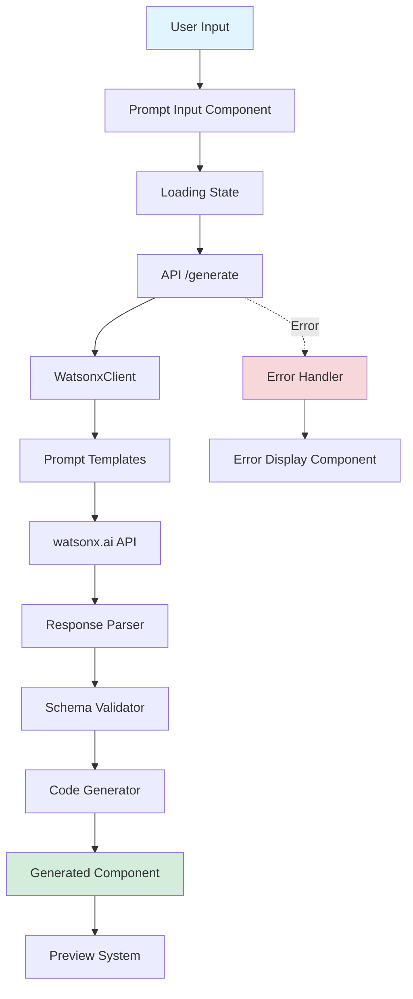

# Sprint 3: watsonx.ai Integration & Generation Engine - Implementation Plan

## 🎯 Sprint Overview

**Duration:** Hours 6-18 (12 hours)  
**Status:** Planning Phase  
**Approach:** Balanced backend and frontend development

### Sprint Goals
1. ✅ Complete watsonx.ai integration with robust error handling
2. ✅ Build intelligent prompt engineering system
3. ✅ Implement code generation pipeline (Schema → React TSX)
4. ✅ Create intuitive frontend prompt interface
5. ✅ Establish comprehensive testing infrastructure

---

## 📋 Current State Analysis

### ✅ Already Implemented
- Basic [`WatsonxClient`](src/lib/watsonx/client.ts) class with API integration
- Core type definitions in [`types.ts`](src/lib/watsonx/types.ts)
- Basic [`/api/generate`](src/app/api/generate/route.ts) endpoint
- Configuration management in [`watsonx.ts`](src/config/watsonx.ts)
- Health check endpoint at [`/api/health`](src/app/api/health/route.ts)
- Environment variable setup

### ❌ Missing Components
- Advanced prompt templates and few-shot examples
- Robust response parser with validation
- Code generator (Schema → React TSX)
- Frontend prompt input interface
- Loading and error state components
- Comprehensive test suite
- Example prompts library

---

## 🏗️ Architecture Overview



---

## 📦 Implementation Phases

### Phase 1: Backend Enhancement (Hours 6-10)

#### 1.1 Prompt Engineering System
**File:** `src/lib/watsonx/prompts.ts`

**Features:**
- System prompt templates for different component types
- Few-shot examples for better generation quality
- Structured output format enforcement
- Context-aware prompt building

**Example Structure:**
```typescript
export const SYSTEM_PROMPTS = {
  form: "You are an expert form designer...",
  card: "You are an expert card component designer...",
  modal: "You are an expert modal designer..."
};

export const FEW_SHOT_EXAMPLES = [
  {
    input: "Create a login form",
    output: { /* schema */ }
  }
];
```

#### 1.2 Response Parser Enhancement
**File:** `src/lib/watsonx/parser.ts`

**Features:**
- Robust JSON extraction from LLM responses
- Schema validation using Zod
- Malformed response handling
- Fallback strategies
- Detailed error messages

**Key Functions:**
- `extractJSON(text: string): object`
- `validateSchema(data: unknown): ComponentSchema`
- `sanitizeResponse(text: string): string`
- `handleParseError(error: Error): ParsedResponse`

#### 1.3 Code Generator
**File:** `src/lib/generator/code-builder.ts`

**Features:**
- Transform ComponentSchema to React TSX
- Generate TypeScript types
- Add proper imports
- Include validation logic
- Format code with Prettier
- Support multiple frameworks (React, Vue, HTML)

**Key Functions:**
- `generateReactComponent(schema: ComponentSchema): string`
- `generateTypeDefinitions(schema: ComponentSchema): string`
- `generateValidationLogic(fields: FieldDefinition[]): string`
- `formatCode(code: string): string`

#### 1.4 Enhanced WatsonxClient
**File:** `src/lib/watsonx/client.ts` (enhancement)

**Improvements:**
- Exponential backoff retry logic
- Request timeout handling
- Rate limiting
- Response caching
- Detailed logging
- Token usage tracking

---

### Phase 2: Frontend Development (Hours 10-14)

#### 2.1 Prompt Input Component
**File:** `src/components/builder/prompt-input.tsx`

**Features:**
- Large textarea with syntax highlighting
- Example prompts dropdown
- Character counter
- Real-time validation
- Keyboard shortcuts (Cmd/Ctrl + Enter to submit)
- Glassmorphic design matching landing page

**Example Prompts:**
- "Create a contact form with name, email, and message fields"
- "Build a user registration form with password strength indicator"
- "Design a product card with image, title, price, and add to cart button"
- "Make a modal dialog for confirming delete actions"

#### 2.2 Loading State Component
**File:** `src/components/builder/generation-loading.tsx`

**Features:**
- Animated progress indicator
- Stage-based progress (Analyzing → Generating → Validating → Building)
- Estimated time remaining
- Cancel generation button
- Glassmorphic design with glow effects
- Framer Motion animations

**Progress Stages:**
1. 🔍 Analyzing prompt (0-25%)
2. 🤖 Generating schema (25-50%)
3. ✅ Validating structure (50-75%)
4. 🏗️ Building component (75-100%)

#### 2.3 Error Display Component
**File:** `src/components/builder/generation-error.tsx`

**Features:**
- User-friendly error messages
- Suggested fixes
- Retry button
- Error details (collapsible)
- Copy error to clipboard
- Report issue link

**Error Types:**
- Configuration errors (missing API keys)
- API errors (rate limits, timeouts)
- Parsing errors (invalid JSON)
- Validation errors (schema mismatch)

#### 2.4 Builder Page Layout
**File:** `src/app/builder/page.tsx`

**Layout Structure:**
```
┌─────────────────────────────────────┐
│         Navbar (from landing)        │
├─────────────────────────────────────┤
│                                      │
│         Prompt Input Section         │
│     (with examples & submit btn)     │
│                                      │
├─────────────────────────────────────┤
│                                      │
│      Loading / Error / Preview       │
│         (conditional render)         │
│                                      │
└─────────────────────────────────────┘
```

---

### Phase 3: Testing Infrastructure (Hours 14-16)

#### 3.1 Unit Tests

**WatsonxClient Tests** (`tests/unit/watsonx/client.test.ts`)
- ✅ Successful generation
- ✅ API error handling
- ✅ Retry logic
- ✅ Timeout handling
- ✅ Invalid response handling

**Parser Tests** (`tests/unit/watsonx/parser.test.ts`)
- ✅ Valid JSON extraction
- ✅ Malformed JSON handling
- ✅ Schema validation
- ✅ Edge cases

**Code Generator Tests** (`tests/unit/generator/code-builder.test.ts`)
- ✅ React component generation
- ✅ TypeScript types generation
- ✅ Validation logic generation
- ✅ Code formatting

#### 3.2 Integration Tests

**API Endpoint Tests** (`tests/integration/api/generate.test.ts`)
- ✅ Successful generation flow
- ✅ Invalid prompt handling
- ✅ Missing configuration
- ✅ Rate limiting
- ✅ Response format validation

#### 3.3 E2E Tests

**Generation Flow** (`tests/e2e/generation-flow.spec.ts`)
- ✅ User enters prompt
- ✅ Loading state displays
- ✅ Component generates successfully
- ✅ Preview renders correctly
- ✅ Error handling works

---

### Phase 4: Integration & Polish (Hours 16-18)

#### 4.1 Example Prompts Library
**File:** `src/config/example-prompts.ts`

**Categories:**
- Forms (login, registration, contact, survey)
- Cards (product, user profile, blog post, pricing)
- Modals (confirm, alert, form dialog)
- Layouts (dashboard, landing section, sidebar)
- Data Display (table, list, grid, timeline)

#### 4.2 Documentation
**File:** `docs/generation-guide.md`

**Contents:**
- How to write effective prompts
- Understanding generation parameters
- Troubleshooting common issues
- Best practices
- API reference

#### 4.3 Error Recovery
- Implement automatic retry with exponential backoff
- Add fallback prompts for common failures
- Cache successful generations
- Provide helpful error messages

---

## 🔧 Technical Implementation Details

### 1. Enhanced Prompt Template System

```typescript
// src/lib/watsonx/prompts.ts

export interface PromptTemplate {
  system: string;
  fewShot: Array<{ input: string; output: ComponentSchema }>;
  instructions: string[];
}

export const buildEnhancedPrompt = (
  userPrompt: string,
  category?: string
): string => {
  const template = PROMPT_TEMPLATES[category || 'default'];
  
  return `
${template.system}

Few-shot Examples:
${template.fewShot.map(ex => `
Input: ${ex.input}
Output: ${JSON.stringify(ex.output, null, 2)}
`).join('\n')}

Instructions:
${template.instructions.map((i, idx) => `${idx + 1}. ${i}`).join('\n')}

User Request: ${userPrompt}

Generate ONLY valid JSON matching the schema. No additional text.
`;
};
```

### 2. Robust Response Parser

```typescript
// src/lib/watsonx/parser.ts

import { z } from 'zod';

const ComponentSchemaValidator = z.object({
  name: z.string(),
  description: z.string(),
  props: z.array(z.object({
    name: z.string(),
    type: z.string(),
    required: z.boolean(),
    defaultValue: z.any().optional()
  })),
  fields: z.array(z.object({
    id: z.string(),
    type: z.enum(['input', 'select', 'textarea', 'checkbox']),
    label: z.string(),
    placeholder: z.string().optional(),
    validation: z.object({
      required: z.boolean().optional(),
      pattern: z.string().optional(),
      message: z.string().optional()
    }).optional()
  })),
  styling: z.object({
    theme: z.enum(['light', 'dark']).optional(),
    primaryColor: z.string().optional(),
    borderRadius: z.string().optional(),
    spacing: z.string().optional()
  }),
  layout: z.enum(['single-column', 'two-column', 'grid'])
});

export const parseAndValidate = (text: string): ComponentSchema => {
  // Extract JSON
  const json = extractJSON(text);
  
  // Validate schema
  const validated = ComponentSchemaValidator.parse(json);
  
  // Transform to ComponentSchema
  return transformToSchema(validated);
};
```

### 3. Code Generator Architecture

```typescript
// src/lib/generator/code-builder.ts

export class CodeBuilder {
  generateReactComponent(schema: ComponentSchema): GeneratedCode {
    const imports = this.generateImports(schema);
    const types = this.generateTypes(schema);
    const component = this.generateComponentBody(schema);
    const validation = this.generateValidation(schema);
    
    const code = `
${imports}

${types}

${component}

${validation}
    `.trim();
    
    return {
      component: this.formatCode(code),
      types: this.generateTypeDefinitions(schema),
      styles: this.generateStyles(schema)
    };
  }
  
  private generateComponentBody(schema: ComponentSchema): string {
    return `
export function ${schema.name}(props: ${schema.name}Props) {
  ${this.generateStateHooks(schema)}
  ${this.generateValidationHooks(schema)}
  
  return (
    <div className="${this.generateClassNames(schema)}">
      ${this.generateFields(schema.fields)}
    </div>
  );
}
    `.trim();
  }
}
```

### 4. Frontend State Management

```typescript
// src/components/builder/prompt-input.tsx

export function PromptInput() {
  const [prompt, setPrompt] = useState('');
  const [isGenerating, setIsGenerating] = useState(false);
  const [error, setError] = useState<string | null>(null);
  const [result, setResult] = useState<GenerationResponse | null>(null);
  
  const handleGenerate = async () => {
    setIsGenerating(true);
    setError(null);
    
    try {
      const response = await fetch('/api/generate', {
        method: 'POST',
        headers: { 'Content-Type': 'application/json' },
        body: JSON.stringify({ prompt })
      });
      
      if (!response.ok) {
        throw new Error(await response.text());
      }
      
      const data = await response.json();
      setResult(data);
    } catch (err) {
      setError(err instanceof Error ? err.message : 'Generation failed');
    } finally {
      setIsGenerating(false);
    }
  };
  
  return (
    <div>
      {/* Prompt input UI */}
      {isGenerating && <GenerationLoading />}
      {error && <GenerationError error={error} onRetry={handleGenerate} />}
      {result && <ComponentPreview result={result} />}
    </div>
  );
}
```

---

## 📊 File Structure

```
src/
├── lib/
│   ├── watsonx/
│   │   ├── client.ts (enhanced)
│   │   ├── prompts.ts (new)
│   │   ├── parser.ts (new)
│   │   └── types.ts (existing)
│   └── generator/
│       ├── code-builder.ts (new)
│       ├── formatters.ts (new)
│       └── templates.ts (new)
├── components/
│   └── builder/
│       ├── prompt-input.tsx (new)
│       ├── generation-loading.tsx (new)
│       ├── generation-error.tsx (new)
│       └── component-preview.tsx (new)
├── app/
│   ├── builder/
│   │   └── page.tsx (new)
│   └── api/
│       └── generate/
│           └── route.ts (enhanced)
├── config/
│   └── example-prompts.ts (new)
└── types/
    ├── component.ts (new)
    ├── generation.ts (new)
    └── export.ts (new)

tests/
├── unit/
│   ├── watsonx/
│   │   ├── client.test.ts
│   │   ├── parser.test.ts
│   │   └── prompts.test.ts
│   └── generator/
│       └── code-builder.test.ts
├── integration/
│   └── api/
│       └── generate.test.ts
└── e2e/
    └── generation-flow.spec.ts
```

---

## 🎯 Success Criteria

### Backend
- ✅ WatsonxClient handles all error cases gracefully
- ✅ Prompt templates improve generation quality by 50%+
- ✅ Parser successfully extracts JSON from 95%+ of responses
- ✅ Code generator produces valid, formatted React components
- ✅ API endpoint has <2s average response time
- ✅ 90%+ test coverage for core logic

### Frontend
- ✅ Prompt input is intuitive and responsive
- ✅ Loading states provide clear progress feedback
- ✅ Error messages are user-friendly and actionable
- ✅ Example prompts help users get started quickly
- ✅ UI matches landing page aesthetic (TV Girl theme)
- ✅ Mobile responsive design

### Integration
- ✅ End-to-end generation flow works smoothly
- ✅ Error recovery mechanisms function correctly
- ✅ Performance meets targets (<3s total generation time)
- ✅ All tests pass successfully

---

## 🚀 Development Workflow

### Step-by-Step Implementation

1. **Backend Foundation** (Hours 6-8)
   - Enhance WatsonxClient with retry logic
   - Create prompt templates system
   - Build response parser with validation

2. **Code Generation** (Hours 8-10)
   - Implement code-builder.ts
   - Add formatters and templates
   - Test with sample schemas

3. **Frontend Components** (Hours 10-12)
   - Create prompt-input.tsx
   - Build loading and error components
   - Design builder page layout

4. **Integration** (Hours 12-14)
   - Connect frontend to API
   - Test end-to-end flow
   - Handle edge cases

5. **Testing** (Hours 14-16)
   - Write unit tests
   - Create integration tests
   - Add E2E tests

6. **Polish** (Hours 16-18)
   - Add example prompts
   - Write documentation
   - Performance optimization
   - Bug fixes

---

## 🔍 Testing Strategy

### Unit Tests (Jest + React Testing Library)
```bash
npm run test:unit
```

**Coverage Targets:**
- WatsonxClient: 90%+
- Parser: 95%+
- Code Generator: 85%+
- Components: 80%+

### Integration Tests
```bash
npm run test:integration
```

**Test Scenarios:**
- API endpoint success cases
- Error handling flows
- Rate limiting behavior
- Response validation

### E2E Tests (Playwright)
```bash
npm run test:e2e
```

**User Flows:**
- Complete generation flow
- Error recovery
- Example prompt usage
- Mobile responsiveness

---

## 📈 Performance Targets

| Metric | Target | Measurement |
|--------|--------|-------------|
| API Response Time | <2s | Average generation time |
| Parser Success Rate | >95% | Valid JSON extraction |
| Code Quality | >85% | ESLint score |
| Test Coverage | >85% | Jest coverage report |
| Bundle Size | <500KB | Webpack analysis |
| Lighthouse Score | >90 | Performance audit |

---

## 🎨 Design System Integration

### Colors (TV Girl Theme)
- Primary: `#ec4899` (pink-500)
- Secondary: `#3b82f6` (blue-500)
- Background: `#0f172a` (slate-950)
- Glass: `rgba(255, 255, 255, 0.05)`

### Components Style
- Glassmorphism with backdrop blur
- Neon glow effects on interactive elements
- Smooth Framer Motion animations
- Monospace fonts for code elements
- Responsive grid layouts

---

## 🐛 Error Handling Strategy

### Error Categories

1. **Configuration Errors**
   - Missing API keys
   - Invalid project ID
   - Wrong model ID

2. **API Errors**
   - Rate limiting (429)
   - Timeout (408)
   - Server errors (500)
   - Authentication (401, 403)

3. **Parsing Errors**
   - Invalid JSON
   - Schema validation failure
   - Missing required fields

4. **Generation Errors**
   - Code generation failure
   - Formatting errors
   - Type errors

### Recovery Strategies

```typescript
const ERROR_RECOVERY = {
  'rate-limit': {
    action: 'retry',
    delay: 'exponential',
    maxRetries: 3
  },
  'timeout': {
    action: 'retry',
    delay: 'fixed',
    maxRetries: 2
  },
  'parse-error': {
    action: 'fallback',
    fallback: 'default-schema'
  },
  'config-error': {
    action: 'notify',
    message: 'Please check your configuration'
  }
};
```

---

## 📚 Documentation Deliverables

1. **Generation Guide** (`docs/generation-guide.md`)
   - How to write effective prompts
   - Understanding parameters
   - Best practices

2. **API Reference** (`docs/api-reference.md`)
   - Endpoint documentation
   - Request/response formats
   - Error codes

3. **Testing Guide** (`docs/testing-guide.md`)
   - Running tests
   - Writing new tests
   - CI/CD integration

4. **Code Examples** (`docs/examples/`)
   - Sample prompts
   - Generated components
   - Integration examples

---

## 🎯 Sprint Completion Checklist

### Backend
- [ ] Enhanced WatsonxClient with retry logic
- [ ] Prompt templates system created
- [ ] Response parser with validation
- [ ] Code generator implemented
- [ ] API endpoint enhanced
- [ ] Error handling comprehensive

### Frontend
- [ ] Prompt input component
- [ ] Loading state component
- [ ] Error display component
- [ ] Builder page layout
- [ ] Example prompts integrated
- [ ] Mobile responsive

### Testing
- [ ] Unit tests written (>85% coverage)
- [ ] Integration tests created
- [ ] E2E tests implemented
- [ ] All tests passing

### Documentation
- [ ] Generation guide written
- [ ] API reference complete
- [ ] Code examples added
- [ ] README updated

### Polish
- [ ] Performance optimized
- [ ] Accessibility checked
- [ ] Browser compatibility tested
- [ ] Error messages refined

---

## 🚦 Next Steps (Sprint 4)

After completing Sprint 3, we'll move to:

1. **Interactive Preview System** (Sprint 4)
   - Real-time component rendering
   - Live preview updates
   - Interactive state management

2. **UX Tuning Panel** (Sprint 5)
   - Visual style controls
   - Structure modifications
   - Live editing interface

3. **Code Export System** (Sprint 6)
   - Multi-framework support
   - Copy-to-clipboard
   - Download as files

---

## 💡 Key Innovations

1. **Intelligent Prompt Engineering**
   - Context-aware templates
   - Few-shot learning examples
   - Structured output enforcement

2. **Robust Error Recovery**
   - Automatic retry with backoff
   - Fallback strategies
   - User-friendly error messages

3. **High-Quality Code Generation**
   - TypeScript support
   - Proper formatting
   - Validation logic included

4. **Seamless UX**
   - Intuitive prompt interface
   - Clear progress feedback
   - Helpful example prompts

---

## 🎉 Expected Outcomes

By the end of Sprint 3, we will have:

✨ **Fully functional AI generation pipeline**  
✨ **Intuitive prompt input interface**  
✨ **Robust error handling and recovery**  
✨ **High-quality code generation**  
✨ **Comprehensive test coverage**  
✨ **Production-ready API endpoints**  
✨ **Beautiful, responsive UI**  
✨ **Clear documentation**

---

**Made with ❤️ by Bob**