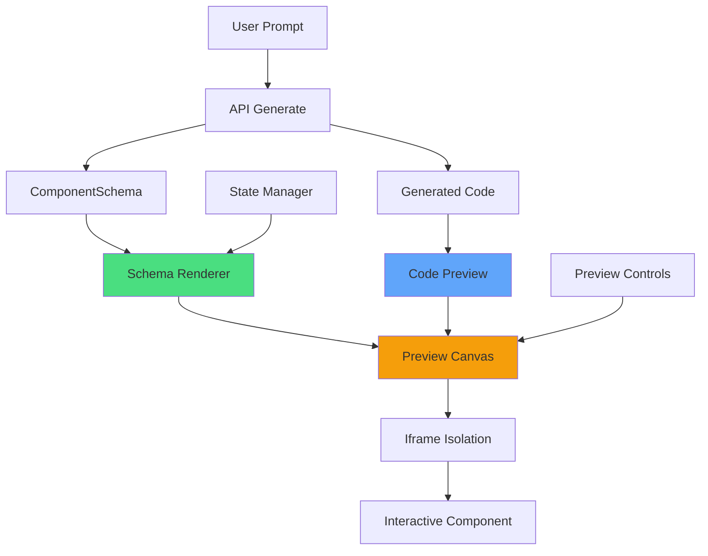
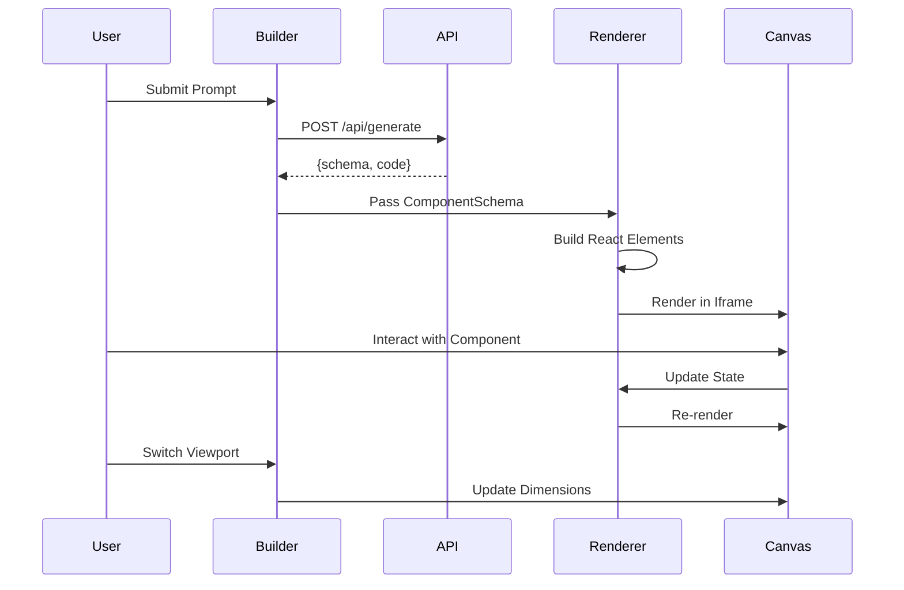

# Sprint 4: Interactive Preview System - Implementation Plan

## 🎯 Executive Summary

**Sprint Goal:** Build an interactive preview system that renders generated components in real-time with a hybrid approach - schema-based rendering with code preview fallback.

**Duration:** Hours 18-27 (9 hours)  
**Status:** 📋 Planning Complete  
**Approach:** Hybrid (Schema Renderer + Code Preview)

---

## 📊 Current State Analysis

### Sprint 3 Completion Status
- ✅ **Backend:** 100% Complete
  - WatsonxClient with retry logic
  - Prompt engineering system
  - Response parser with 5 fallback strategies
  - Code generator (React TSX)
  - API endpoint with rate limiting
  
- ✅ **Frontend:** 100% Complete
  - PromptInput component with 40+ examples
  - GenerationLoading with 4-stage progress
  - GenerationError with helpful hints
  - BuilderClient orchestration

- ⏳ **Testing:** 0% Complete (deferred)

### What We Have
```typescript
// Generated from API
interface GenerationResponse {
  schema: ComponentSchema;
  metadata: { model, tokensUsed, generationTime };
}

// Code builder output
interface GeneratedCode {
  component: string;  // React TSX code
  types: string;      // TypeScript types
  styles?: string;    // CSS/Tailwind
}
```

### What We Need
- Interactive preview canvas
- Dynamic component renderer
- State management for preview
- Viewport controls (mobile/tablet/desktop)
- Real-time updates
- Iframe isolation for safety

---

## 🏗️ Architecture Design

### System Overview



### Data Flow



### Component Hierarchy

```
BuilderClient (existing)
├── PromptInput (existing)
├── GenerationLoading (existing)
├── GenerationError (existing)
└── PreviewSection (NEW)
    ├── PreviewCanvas (NEW)
    │   ├── ViewportControls (NEW)
    │   ├── PreviewFrame (NEW - iframe)
    │   │   └── DynamicRenderer (NEW)
    │   └── PreviewToolbar (NEW)
    └── CodeViewer (existing - enhanced)
```

---

## 📁 File Structure

### New Files to Create

```
src/
├── lib/
│   └── preview/
│       ├── index.ts                    # Public API exports
│       ├── renderer.tsx                # Dynamic React renderer
│       ├── state-manager.ts            # Preview state management
│       ├── iframe-bridge.ts            # Parent-iframe communication
│       └── types.ts                    # Preview-specific types
│
├── hooks/
│   └── use-preview.ts                  # Preview state hook
│
└── components/
    └── builder/
        ├── preview-canvas.tsx          # Main preview container
        ├── preview-frame.tsx           # Iframe wrapper
        ├── preview-controls.tsx        # Viewport/theme controls
        ├── preview-toolbar.tsx         # Zoom/reset/export
        └── code-viewer.tsx             # Enhanced code display
```

### Files to Modify

```
src/
├── app/
│   └── builder/
│       └── builder-client.tsx          # Add preview integration
│
└── lib/
    └── generator/
        └── code-builder.ts             # Add preview-friendly output
```

---

## 🔧 Technical Implementation

### 1. Preview Types (`src/lib/preview/types.ts`)

```typescript
export type ViewportSize = 'mobile' | 'tablet' | 'desktop' | 'full';
export type PreviewTheme = 'light' | 'dark' | 'system';
export type RenderMode = 'schema' | 'code' | 'hybrid';

export interface ViewportConfig {
  size: ViewportSize;
  width: number;
  height: number;
  label: string;
}

export interface PreviewState {
  mode: RenderMode;
  viewport: ViewportSize;
  theme: PreviewTheme;
  zoom: number;
  formData: Record<string, any>;
  errors: Record<string, string>;
  isInteractive: boolean;
}

export interface PreviewProps {
  schema: ComponentSchema;
  code: string;
  initialState?: Partial<PreviewState>;
  onStateChange?: (state: PreviewState) => void;
  onError?: (error: Error) => void;
}

export interface RendererProps {
  schema: ComponentSchema;
  formData: Record<string, any>;
  errors: Record<string, string>;
  onFieldChange: (fieldId: string, value: any) => void;
  onSubmit: (data: Record<string, any>) => void;
}
```

### 2. Dynamic Renderer (`src/lib/preview/renderer.tsx`)

**Purpose:** Convert ComponentSchema to React elements using `React.createElement()`

**Key Features:**
- Schema-to-React element conversion
- Form state management
- Validation handling
- Event handlers
- Conditional rendering
- Accessibility attributes

**Implementation Strategy:**
```typescript
export function DynamicRenderer({ schema, formData, errors, onFieldChange, onSubmit }: RendererProps) {
  // 1. Build field elements from schema
  const fieldElements = schema.fields.map(field => 
    createFieldElement(field, formData, errors, onFieldChange)
  );
  
  // 2. Apply layout structure
  const layoutElement = applyLayout(fieldElements, schema.layout);
  
  // 3. Wrap in form with styling
  return createFormWrapper(layoutElement, schema.styling, onSubmit);
}

function createFieldElement(field: FieldDefinition, ...): ReactElement {
  switch (field.type) {
    case 'input': return createInputField(field, ...);
    case 'select': return createSelectField(field, ...);
    case 'textarea': return createTextareaField(field, ...);
    case 'checkbox': return createCheckboxField(field, ...);
    case 'radio': return createRadioField(field, ...);
    case 'date': return createDateField(field, ...);
    case 'file': return createFileField(field, ...);
  }
}
```

### 3. State Manager (`src/lib/preview/state-manager.ts`)

**Purpose:** Manage preview state, form data, and validation

**Key Features:**
- Form data tracking
- Validation logic
- Error management
- State persistence
- Change notifications

**Implementation Strategy:**
```typescript
export class PreviewStateManager {
  private state: PreviewState;
  private schema: ComponentSchema;
  private listeners: Set<(state: PreviewState) => void>;
  
  constructor(schema: ComponentSchema, initialState?: Partial<PreviewState>) {
    this.schema = schema;
    this.state = this.initializeState(initialState);
    this.listeners = new Set();
  }
  
  // Field updates
  updateField(fieldId: string, value: any): void {
    this.state.formData[fieldId] = value;
    this.validateField(fieldId);
    this.notifyListeners();
  }
  
  // Validation
  validateField(fieldId: string): boolean {
    const field = this.schema.fields.find(f => f.id === fieldId);
    if (!field?.validation) return true;
    
    const value = this.state.formData[fieldId];
    const error = this.runValidation(field, value);
    
    if (error) {
      this.state.errors[fieldId] = error;
      return false;
    } else {
      delete this.state.errors[fieldId];
      return true;
    }
  }
  
  validateAll(): boolean {
    let isValid = true;
    for (const field of this.schema.fields) {
      if (!this.validateField(field.id)) {
        isValid = false;
      }
    }
    return isValid;
  }
  
  // State management
  getState(): PreviewState {
    return { ...this.state };
  }
  
  subscribe(listener: (state: PreviewState) => void): () => void {
    this.listeners.add(listener);
    return () => this.listeners.delete(listener);
  }
  
  private notifyListeners(): void {
    this.listeners.forEach(listener => listener(this.getState()));
  }
}
```

### 4. Iframe Bridge (`src/lib/preview/iframe-bridge.ts`)

**Purpose:** Safe communication between parent and iframe

**Key Features:**
- PostMessage API
- Message validation
- Error boundaries
- Style injection
- Script isolation

**Implementation Strategy:**
```typescript
export interface IframeMessage {
  type: 'render' | 'update' | 'error' | 'ready';
  payload: any;
}

export class IframeBridge {
  private iframe: HTMLIFrameElement;
  private ready: boolean = false;
  private messageQueue: IframeMessage[] = [];
  
  constructor(iframe: HTMLIFrameElement) {
    this.iframe = iframe;
    this.setupMessageListener();
  }
  
  sendMessage(message: IframeMessage): void {
    if (!this.ready) {
      this.messageQueue.push(message);
      return;
    }
    
    this.iframe.contentWindow?.postMessage(message, '*');
  }
  
  private setupMessageListener(): void {
    window.addEventListener('message', (event) => {
      if (event.source !== this.iframe.contentWindow) return;
      
      const message = event.data as IframeMessage;
      this.handleMessage(message);
    });
  }
  
  private handleMessage(message: IframeMessage): void {
    switch (message.type) {
      case 'ready':
        this.ready = true;
        this.flushMessageQueue();
        break;
      case 'error':
        console.error('Iframe error:', message.payload);
        break;
    }
  }
  
  private flushMessageQueue(): void {
    while (this.messageQueue.length > 0) {
      const message = this.messageQueue.shift()!;
      this.sendMessage(message);
    }
  }
}
```

### 5. Preview Hook (`src/hooks/use-preview.ts`)

**Purpose:** React hook for preview state management

**Key Features:**
- State initialization
- Update handlers
- Viewport management
- Theme switching
- Zoom controls

**Implementation Strategy:**
```typescript
export function usePreview(schema: ComponentSchema, code: string) {
  const [state, setState] = useState<PreviewState>(() => ({
    mode: 'schema',
    viewport: 'desktop',
    theme: 'light',
    zoom: 100,
    formData: {},
    errors: {},
    isInteractive: true
  }));
  
  const stateManager = useRef<PreviewStateManager>();
  
  useEffect(() => {
    stateManager.current = new PreviewStateManager(schema, state);
    
    const unsubscribe = stateManager.current.subscribe((newState) => {
      setState(newState);
    });
    
    return unsubscribe;
  }, [schema]);
  
  const updateField = useCallback((fieldId: string, value: any) => {
    stateManager.current?.updateField(fieldId, value);
  }, []);
  
  const setViewport = useCallback((viewport: ViewportSize) => {
    setState(prev => ({ ...prev, viewport }));
  }, []);
  
  const setTheme = useCallback((theme: PreviewTheme) => {
    setState(prev => ({ ...prev, theme }));
  }, []);
  
  const setZoom = useCallback((zoom: number) => {
    setState(prev => ({ ...prev, zoom: Math.max(50, Math.min(200, zoom)) }));
  }, []);
  
  const reset = useCallback(() => {
    stateManager.current = new PreviewStateManager(schema);
    setState(stateManager.current.getState());
  }, [schema]);
  
  return {
    state,
    updateField,
    setViewport,
    setTheme,
    setZoom,
    reset,
    validateAll: () => stateManager.current?.validateAll() ?? false
  };
}
```

### 6. Preview Canvas (`src/components/builder/preview-canvas.tsx`)

**Purpose:** Main preview container with controls

**Key Features:**
- Viewport switcher
- Theme toggle
- Zoom controls
- Reset button
- Responsive layout
- Loading states

**UI Structure:**
```tsx
export function PreviewCanvas({ schema, code }: PreviewProps) {
  const preview = usePreview(schema, code);
  
  return (
    <Card className="overflow-hidden">
      {/* Header with controls */}
      <div className="border-b border-white/10 bg-black/20 p-4">
        <div className="flex items-center justify-between gap-4">
          <h2>Interactive Preview</h2>
          <PreviewControls
            viewport={preview.state.viewport}
            theme={preview.state.theme}
            zoom={preview.state.zoom}
            onViewportChange={preview.setViewport}
            onThemeChange={preview.setTheme}
            onZoomChange={preview.setZoom}
            onReset={preview.reset}
          />
        </div>
      </div>
      
      {/* Preview frame */}
      <div className="relative bg-gradient-to-br from-slate-900 to-slate-800 p-8">
        <PreviewFrame
          schema={schema}
          code={code}
          state={preview.state}
          onFieldChange={preview.updateField}
        />
      </div>
      
      {/* Toolbar */}
      <PreviewToolbar
        onExport={() => {/* Export logic */}}
        onCopy={() => navigator.clipboard.writeText(code)}
      />
    </Card>
  );
}
```

### 7. Preview Frame (`src/components/builder/preview-frame.tsx`)

**Purpose:** Iframe wrapper with dynamic rendering

**Key Features:**
- Iframe isolation
- Style injection
- Error boundaries
- Responsive sizing
- Loading states

**Implementation Strategy:**
```tsx
export function PreviewFrame({ schema, code, state, onFieldChange }: PreviewFrameProps) {
  const iframeRef = useRef<HTMLIFrameElement>(null);
  const [isReady, setIsReady] = useState(false);
  const [error, setError] = useState<Error | null>(null);
  
  useEffect(() => {
    if (!iframeRef.current || !isReady) return;
    
    const bridge = new IframeBridge(iframeRef.current);
    
    bridge.sendMessage({
      type: 'render',
      payload: { schema, state }
    });
    
    return () => {
      // Cleanup
    };
  }, [schema, state, isReady]);
  
  const viewportConfig = VIEWPORT_CONFIGS[state.viewport];
  
  return (
    <div className="relative mx-auto" style={{ maxWidth: viewportConfig.width }}>
      {!isReady && <LoadingSpinner />}
      {error && <ErrorDisplay error={error} />}
      
      <iframe
        ref={iframeRef}
        className="w-full rounded-lg border border-white/10 bg-white dark:bg-slate-950"
        style={{
          height: viewportConfig.height,
          transform: `scale(${state.zoom / 100})`,
          transformOrigin: 'top center'
        }}
        sandbox="allow-scripts allow-same-origin"
        onLoad={() => setIsReady(true)}
        srcDoc={generateIframeContent(schema, code)}
      />
    </div>
  );
}

function generateIframeContent(schema: ComponentSchema, code: string): string {
  return `
    <!DOCTYPE html>
    <html>
      <head>
        <meta charset="utf-8">
        <meta name="viewport" content="width=device-width, initial-scale=1">
        <script src="https://cdn.tailwindcss.com"></script>
        <style>
          body { margin: 0; padding: 16px; }
          ${generateCustomStyles(schema.styling)}
        </style>
      </head>
      <body>
        <div id="root"></div>
        <script type="module">
          ${generateRenderScript(schema)}
        </script>
      </body>
    </html>
  `;
}
```

### 8. Preview Controls (`src/components/builder/preview-controls.tsx`)

**Purpose:** Viewport, theme, and zoom controls

**UI Components:**
```tsx
export function PreviewControls({
  viewport,
  theme,
  zoom,
  onViewportChange,
  onThemeChange,
  onZoomChange,
  onReset
}: PreviewControlsProps) {
  return (
    <div className="flex items-center gap-2">
      {/* Viewport selector */}
      <Select value={viewport} onValueChange={onViewportChange}>
        <SelectTrigger className="w-32">
          <SelectValue />
        </SelectTrigger>
        <SelectContent>
          <SelectItem value="mobile">📱 Mobile</SelectItem>
          <SelectItem value="tablet">📱 Tablet</SelectItem>
          <SelectItem value="desktop">💻 Desktop</SelectItem>
          <SelectItem value="full">🖥️ Full</SelectItem>
        </SelectContent>
      </Select>
      
      {/* Theme toggle */}
      <Button
        variant="outline"
        size="sm"
        onClick={() => onThemeChange(theme === 'light' ? 'dark' : 'light')}
      >
        {theme === 'light' ? '🌙' : '☀️'}
      </Button>
      
      {/* Zoom controls */}
      <div className="flex items-center gap-1">
        <Button
          variant="outline"
          size="sm"
          onClick={() => onZoomChange(zoom - 10)}
          disabled={zoom <= 50}
        >
          -
        </Button>
        <span className="min-w-[3rem] text-center text-sm">{zoom}%</span>
        <Button
          variant="outline"
          size="sm"
          onClick={() => onZoomChange(zoom + 10)}
          disabled={zoom >= 200}
        >
          +
        </Button>
      </div>
      
      {/* Reset button */}
      <Button variant="outline" size="sm" onClick={onReset}>
        Reset
      </Button>
    </div>
  );
}
```

---

## 🔄 Integration with Builder

### Updated BuilderClient Flow

```tsx
export function BuilderClient() {
  const [phase, setPhase] = useState<BuilderPhase>("idle");
  const [generatedSchema, setGeneratedSchema] = useState<ComponentSchema | null>(null);
  const [generatedCode, setGeneratedCode] = useState<string>("");
  
  const runGenerate = async (prompt: string) => {
    setPhase("loading");
    
    const response = await fetch("/api/generate", {
      method: "POST",
      body: JSON.stringify({ prompt })
    });
    
    const data = await response.json();
    
    if (data.success) {
      setGeneratedSchema(data.schema);  // NEW: Store schema
      setGeneratedCode(data.code);
      setPhase("success");
    }
  };
  
  return (
    <div>
      <PromptInput onGenerate={runGenerate} />
      
      {phase === "loading" && <GenerationLoading />}
      {phase === "error" && <GenerationError />}
      
      {phase === "success" && generatedSchema && (
        <div className="grid gap-6 lg:grid-cols-2">
          {/* NEW: Interactive Preview */}
          <PreviewCanvas
            schema={generatedSchema}
            code={generatedCode}
          />
          
          {/* Enhanced Code Viewer */}
          <CodeViewer code={generatedCode} />
        </div>
      )}
    </div>
  );
}
```

### API Response Enhancement

Update [`/api/generate`](src/app/api/generate/route.ts) to return both schema and code:

```typescript
// Current response
return NextResponse.json({
  success: true,
  code: generatedCode.component
});

// Enhanced response
return NextResponse.json({
  success: true,
  schema: response.schema,  // NEW: Include schema
  code: generatedCode.component,
  metadata: response.metadata
});
```

---

## 🎨 UI/UX Design

### Viewport Configurations

```typescript
export const VIEWPORT_CONFIGS: Record<ViewportSize, ViewportConfig> = {
  mobile: {
    size: 'mobile',
    width: 375,
    height: 667,
    label: 'iPhone SE'
  },
  tablet: {
    size: 'tablet',
    width: 768,
    height: 1024,
    label: 'iPad'
  },
  desktop: {
    size: 'desktop',
    width: 1440,
    height: 900,
    label: 'Desktop'
  },
  full: {
    size: 'full',
    width: 9999,
    height: 9999,
    label: 'Full Width'
  }
};
```

### Theme System

```typescript
export const THEME_STYLES = {
  light: {
    background: 'bg-white',
    text: 'text-slate-900',
    border: 'border-slate-200'
  },
  dark: {
    background: 'bg-slate-950',
    text: 'text-slate-100',
    border: 'border-slate-800'
  }
};
```

### Glassmorphism Styling

```css
.preview-canvas {
  background: rgba(15, 23, 42, 0.6);
  backdrop-filter: blur(20px);
  border: 1px solid rgba(255, 255, 255, 0.1);
}

.preview-frame {
  box-shadow: 0 20px 60px rgba(0, 0, 0, 0.3);
  border-radius: 12px;
}
```

---

## 🧪 Testing Strategy

### Unit Tests

**File:** `tests/unit/preview/renderer.test.tsx`
```typescript
describe('DynamicRenderer', () => {
  it('renders input fields from schema', () => {});
  it('handles field changes', () => {});
  it('validates required fields', () => {});
  it('shows validation errors', () => {});
  it('handles form submission', () => {});
  it('applies conditional rendering', () => {});
});
```

**File:** `tests/unit/preview/state-manager.test.ts`
```typescript
describe('PreviewStateManager', () => {
  it('initializes with default state', () => {});
  it('updates field values', () => {});
  it('validates fields', () => {});
  it('notifies listeners on change', () => {});
  it('handles validation errors', () => {});
});
```

### Integration Tests

**File:** `tests/integration/preview-flow.test.tsx`
```typescript
describe('Preview Flow', () => {
  it('renders component from schema', () => {});
  it('updates preview on field change', () => {});
  it('switches viewports', () => {});
  it('toggles theme', () => {});
  it('handles zoom', () => {});
});
```

### E2E Tests

**File:** `tests/e2e/preview.spec.ts`
```typescript
test('complete preview flow', async ({ page }) => {
  // Generate component
  // Verify preview renders
  // Interact with form
  // Switch viewport
  // Export code
});
```

---

## 📋 Implementation Checklist

### Phase 1: Core Infrastructure (3 hours)

- [ ] Create preview types (`src/lib/preview/types.ts`)
- [ ] Implement state manager (`src/lib/preview/state-manager.ts`)
- [ ] Build iframe bridge (`src/lib/preview/iframe-bridge.ts`)
- [ ] Create preview hook (`src/hooks/use-preview.ts`)
- [ ] Add viewport configurations

### Phase 2: Dynamic Renderer (3 hours)

- [ ] Implement base renderer (`src/lib/preview/renderer.tsx`)
- [ ] Create field element builders
  - [ ] Input fields (text, email, password, etc.)
  - [ ] Select dropdowns
  - [ ] Textarea
  - [ ] Checkbox
  - [ ] Radio buttons
  - [ ] Date picker
  - [ ] File upload
- [ ] Add layout system (single-column, two-column, grid)
- [ ] Implement validation logic
- [ ] Add conditional rendering
- [ ] Apply styling from schema

### Phase 3: Preview UI Components (2 hours)

- [ ] Build preview canvas (`src/components/builder/preview-canvas.tsx`)
- [ ] Create preview frame (`src/components/builder/preview-frame.tsx`)
- [ ] Implement preview controls (`src/components/builder/preview-controls.tsx`)
- [ ] Add preview toolbar (`src/components/builder/preview-toolbar.tsx`)
- [ ] Style with glassmorphism
- [ ] Add loading states
- [ ] Add error boundaries

### Phase 4: Integration (1 hour)

- [ ] Update BuilderClient to use preview
- [ ] Enhance API response to include schema
- [ ] Add preview/code toggle
- [ ] Implement responsive layout (side-by-side on desktop)
- [ ] Add keyboard shortcuts
- [ ] Test complete flow

---

## 🎯 Success Criteria

### Must Have ✅
- [ ] Dynamic component rendering from schema
- [ ] Interactive form with state management
- [ ] Viewport switcher (mobile/tablet/desktop)
- [ ] Theme toggle (light/dark)
- [ ] Iframe isolation for safety
- [ ] Real-time updates on interaction
- [ ] Error handling and boundaries
- [ ] Responsive layout

### Nice to Have 🌟
- [ ] Zoom controls (50%-200%)
- [ ] Reset button
- [ ] Export from preview
- [ ] Copy code button
- [ ] Keyboard shortcuts
- [ ] Loading animations
- [ ] Smooth transitions

### Testing 🧪
- [ ] Unit tests for renderer
- [ ] Unit tests for state manager
- [ ] Integration tests for preview flow
- [ ] E2E test for complete journey

---

## 🚀 Performance Targets

| Metric | Target | Strategy |
|--------|--------|----------|
| Initial Render | <200ms | Lazy load iframe content |
| State Update | <50ms | Optimized state manager |
| Viewport Switch | <100ms | CSS transforms only |
| Theme Toggle | <100ms | CSS variables |
| Memory Usage | <50MB | Cleanup on unmount |

---

## 🔒 Security Considerations

### Iframe Sandbox
```html
<iframe sandbox="allow-scripts allow-same-origin">
```

### Content Security Policy
```typescript
const CSP = {
  'default-src': ["'self'"],
  'script-src': ["'self'", "'unsafe-inline'", "cdn.tailwindcss.com"],
  'style-src': ["'self'", "'unsafe-inline'"],
  'img-src': ["'self'", "data:", "https:"]
};
```

### Input Sanitization
- Sanitize all user input before rendering
- Validate schema structure
- Escape HTML in generated code
- Prevent XSS attacks

---

## 📊 File Size Estimates

| File | Estimated LOC | Complexity |
|------|---------------|------------|
| `types.ts` | 100 | Low |
| `state-manager.ts` | 250 | Medium |
| `renderer.tsx` | 400 | High |
| `iframe-bridge.ts` | 150 | Medium |
| `use-preview.ts` | 150 | Medium |
| `preview-canvas.tsx` | 200 | Medium |
| `preview-frame.tsx` | 150 | Medium |
| `preview-controls.tsx` | 100 | Low |
| `preview-toolbar.tsx` | 80 | Low |
| **Total** | **~1,580** | **Medium-High** |

---

## 🎨 Design Mockup

### Desktop Layout (1440px+)
```
┌─────────────────────────────────────────────────────────┐
│ Builder Header                                          │
├─────────────────────────────────────────────────────────┤
│ Prompt Input                                            │
├──────────────────────────┬──────────────────────────────┤
│ Interactive Preview      │ Generated Code               │
│ ┌──────────────────────┐ │ ┌──────────────────────────┐ │
│ │ [📱][💻][🌙][100%]   │ │ │ import React...          │ │
│ ├──────────────────────┤ │ │                          │ │
│ │                      │ │ │ export function...       │ │
│ │   [Component]        │ │ │                          │ │
│ │                      │ │ │ return (                 │ │
│ │                      │ │ │   <form>                 │ │
│ └──────────────────────┘ │ │     ...                  │ │
│ [Export][Copy][Reset]    │ │   </form>                │ │
│                          │ │ )                        │ │
│                          │ └──────────────────────────┘ │
│                          │ [Copy Code]                  │
└──────────────────────────┴──────────────────────────────┘
```

### Mobile Layout (<768px)
```
┌─────────────────────┐
│ Builder Header      │
├─────────────────────┤
│ Prompt Input        │
├─────────────────────┤
│ [Preview][Code]     │
├─────────────────────┤
│ Interactive Preview │
│ ┌─────────────────┐ │
│ │ [📱][🌙][100%] │ │
│ ├─────────────────┤ │
│ │                 │ │
│ │  [Component]    │ │
│ │                 │ │
│ └─────────────────┘ │
│ [Export][Copy]      │
└─────────────────────┘
```

---

## 🔄 Hybrid Approach Details

### Primary: Schema-Based Rendering
- Use [`React.createElement()`](React.createElement) for dynamic rendering
- Direct schema-to-component conversion
- Real-time interactivity
- Full state management

### Fallback: Code Preview
- If schema rendering fails
- Parse and display generated code
- Syntax highlighting
- Copy functionality

### Decision Logic
```typescript
function renderPreview(schema: ComponentSchema, code: string) {
  try {
    // Try schema-based rendering first
    return <DynamicRenderer schema={schema} />;
  } catch (error) {
    console.error('Schema rendering failed:', error);
    // Fallback to code preview
    return <CodeViewer code={code} />;
  }
}
```

---

## 📚 Documentation Deliverables

1. **SPRINT4_IMPLEMENTATION.md** - Detailed implementation guide
2. **docs/preview-system.md** - Architecture and API docs
3. **docs/preview-examples.md** - Usage examples
4. **SPRINT4_COMPLETION.md** - Final completion report

---

## 🎯 Next Steps After Sprint 4

### Sprint 5: UX Tuning Panel
- Visual style editor
- Field management (add/remove/reorder)
- Real-time preview updates
- Export with customizations

### Sprint 6: Code Export System
- Multiple framework support (React, Vue, HTML)
- Package.json generation
- README generation
- ZIP download

---

## 🏆 Success Metrics

### Functionality
- ✅ Component renders from schema
- ✅ Interactive form with validation
- ✅ Viewport switching works
- ✅ Theme toggle works
- ✅ State updates in real-time

### Performance
- ✅ Initial render <200ms
- ✅ State updates <50ms
- ✅ Smooth animations (60fps)

### User Experience
- ✅ Intuitive controls
- ✅ Clear visual feedback
- ✅ Responsive design
- ✅ Accessible (WCAG 2.1 AA)

---

## 🎉 Conclusion

Sprint 4 will deliver a **production-ready interactive preview system** with:

✨ **Hybrid Rendering** - Schema-based with code fallback  
✨ **Real-time Interactivity** - Live form state management  
✨ **Responsive Preview** - Mobile/tablet/desktop viewports  
✨ **Safe Isolation** - Iframe sandbox for security  
✨ **Beautiful UI** - Glassmorphism with smooth animations  
✨ **Developer-Friendly** - Clean architecture, well-tested

**Estimated Completion:** 9 hours  
**Complexity:** Medium-High  
**Risk Level:** Low (Hybrid approach reduces risk)

---

**Ready to implement? Let's switch to Code mode! 🚀**

---

*Made with ❤️ by Bob*