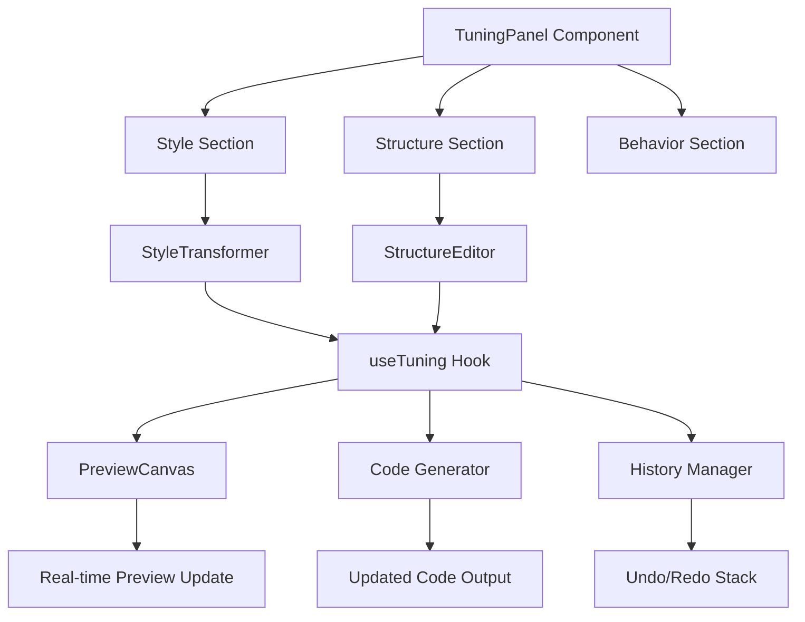

# Sprint 5: UX Tuning Panel - Implementation Plan

## 📋 Executive Summary

**Sprint Goal:** Build a comprehensive UX tuning panel that allows users to visually customize generated components in real-time without writing code.

**Duration:** Hours 27-36 (9 hours)  
**Status:** 🟡 Planning Phase  
**Dependencies:** Sprint 4 (Interactive Preview System) ✅ Complete

---

## 🎯 Sprint Objectives

### Primary Goals
1. ✅ Create visual style editor with real-time preview updates
2. ✅ Implement structure editor for field management (add/remove/reorder)
3. ✅ Build collapsible tuning panel with organized sections
4. ✅ Add undo/redo functionality for all changes
5. ✅ Integrate seamlessly with existing preview system

### Success Criteria
- [ ] Users can adjust styles (colors, spacing, borders) via UI controls
- [ ] Users can add, remove, and reorder form fields
- [ ] All changes reflect instantly in the preview
- [ ] Undo/redo works for all tuning operations
- [ ] Panel is responsive and follows TV Girl aesthetic
- [ ] Code updates automatically with tuning changes

---

## 🏗️ Architecture Overview



### Data Flow

```
User Interaction (Tuning Panel)
    ↓
useTuning Hook (State Management)
    ↓
StyleTransformer / StructureEditor (Apply Changes)
    ↓
Updated Schema + Style Overrides
    ↓
PreviewCanvas (Re-render) + Code Generator (Update Code)
    ↓
Visual Feedback + Updated Code Display
```

---

## 📁 File Structure

```
src/
├── types/
│   └── tuning.ts                    # NEW: Tuning type definitions
├── lib/
│   └── tuning/
│       ├── style-transformer.ts     # NEW: Style transformation logic
│       ├── structure-editor.ts      # NEW: Field management logic
│       └── index.ts                 # NEW: Public exports
├── hooks/
│   └── use-tuning.ts                # NEW: Tuning state management hook
├── components/
│   ├── builder/
│   │   ├── tuning-panel.tsx         # NEW: Main tuning panel
│   │   ├── style-controls.tsx       # NEW: Style control widgets
│   │   ├── structure-controls.tsx   # NEW: Field management UI
│   │   └── tuning-section.tsx       # NEW: Collapsible section wrapper
│   └── ui/
│       ├── slider.tsx               # NEW: Shadcn slider component
│       ├── select.tsx               # NEW: Shadcn select component
│       └── switch.tsx               # NEW: Shadcn switch component
└── app/
    └── builder/
        └── builder-client.tsx       # MODIFIED: Integrate tuning panel
```

---

## 🔧 Technical Specifications

### 1. Tuning Types (`src/types/tuning.ts`)

```typescript
export interface TuningState {
  componentId: string;
  styleOverrides: StyleOverrides;
  structureChanges: StructureChanges;
  behaviorSettings: BehaviorSettings;
  history: HistoryEntry[];
  historyIndex: number;
}

export interface StyleOverrides {
  // Border & Spacing
  borderRadius?: 'none' | 'sm' | 'md' | 'lg' | 'xl' | '2xl' | 'full';
  spacing?: 'compact' | 'normal' | 'relaxed';
  
  // Colors
  primaryColor?: string;
  secondaryColor?: string;
  backgroundColor?: string;
  textColor?: string;
  
  // Typography
  fontFamily?: 'sans' | 'serif' | 'mono';
  fontSize?: 'sm' | 'base' | 'lg';
  
  // Custom
  customClasses?: string[];
}

export interface StructureChanges {
  fieldsAdded: FieldDefinition[];
  fieldsRemoved: string[];           // Field IDs
  fieldsReordered: string[];         // New order of field IDs
  fieldsModified: Record<string, Partial<FieldDefinition>>;
  layoutChanged?: 'single-column' | 'two-column' | 'grid';
}

export interface BehaviorSettings {
  validationMode?: 'onBlur' | 'onChange' | 'onSubmit';
  showErrorsInline?: boolean;
  autoFocus?: boolean;
  submitOnEnter?: boolean;
}

export interface HistoryEntry {
  timestamp: number;
  type: 'style' | 'structure' | 'behavior';
  changes: Partial<TuningState>;
  description: string;
}

export interface TuningControl {
  id: string;
  category: 'style' | 'structure' | 'behavior';
  label: string;
  type: 'slider' | 'color' | 'select' | 'toggle' | 'text';
  value: any;
  options?: {
    min?: number;
    max?: number;
    step?: number;
    choices?: { label: string; value: any }[];
  };
  onChange: (value: any) => void;
}
```

### 2. Style Transformer (`src/lib/tuning/style-transformer.ts`)

**Purpose:** Apply style overrides to component schema and generate updated Tailwind classes.

**Key Functions:**
- `applyStyleOverrides(schema, overrides)` - Apply style changes to schema
- `generateTailwindClasses(overrides)` - Convert overrides to Tailwind classes
- `updateComponentCode(code, overrides)` - Update code with new styles
- `mergeStyles(base, overrides)` - Merge base styles with overrides

**Implementation Strategy:**
```typescript
export class StyleTransformer {
  // Apply style overrides to schema
  applyStyleOverrides(
    schema: ComponentSchema,
    overrides: StyleOverrides
  ): ComponentSchema {
    const updatedSchema = { ...schema };
    
    // Update styling config
    updatedSchema.styling = {
      ...schema.styling,
      ...overrides
    };
    
    return updatedSchema;
  }
  
  // Generate Tailwind classes from overrides
  generateTailwindClasses(overrides: StyleOverrides): string[] {
    const classes: string[] = [];
    
    // Border radius
    if (overrides.borderRadius) {
      classes.push(`rounded-${overrides.borderRadius}`);
    }
    
    // Spacing
    if (overrides.spacing === 'compact') {
      classes.push('space-y-2', 'p-4');
    } else if (overrides.spacing === 'relaxed') {
      classes.push('space-y-6', 'p-8');
    }
    
    // Colors (using CSS variables)
    if (overrides.primaryColor) {
      classes.push('text-primary');
    }
    
    return classes;
  }
  
  // Update code with new styles
  updateComponentCode(
    code: string,
    overrides: StyleOverrides
  ): string {
    // Parse code and update className attributes
    // This is a simplified version - actual implementation
    // would use AST parsing for robustness
    let updatedCode = code;
    
    const newClasses = this.generateTailwindClasses(overrides);
    // Apply class updates to code...
    
    return updatedCode;
  }
}
```

### 3. Structure Editor (`src/lib/tuning/structure-editor.ts`)

**Purpose:** Manage field operations (add, remove, reorder, modify).

**Key Functions:**
- `addField(schema, field, position)` - Add new field
- `removeField(schema, fieldId)` - Remove field
- `reorderFields(schema, newOrder)` - Reorder fields
- `modifyField(schema, fieldId, changes)` - Update field properties
- `changeLayout(schema, layout)` - Change form layout

**Implementation Strategy:**
```typescript
export class StructureEditor {
  // Add field to schema
  addField(
    schema: ComponentSchema,
    field: FieldDefinition,
    position?: number
  ): ComponentSchema {
    const updatedSchema = { ...schema };
    const fields = [...schema.fields];
    
    if (position !== undefined) {
      fields.splice(position, 0, field);
    } else {
      fields.push(field);
    }
    
    updatedSchema.fields = fields;
    return updatedSchema;
  }
  
  // Remove field from schema
  removeField(
    schema: ComponentSchema,
    fieldId: string
  ): ComponentSchema {
    const updatedSchema = { ...schema };
    updatedSchema.fields = schema.fields.filter(f => f.id !== fieldId);
    return updatedSchema;
  }
  
  // Reorder fields
  reorderFields(
    schema: ComponentSchema,
    newOrder: string[]
  ): ComponentSchema {
    const updatedSchema = { ...schema };
    const fieldMap = new Map(schema.fields.map(f => [f.id, f]));
    
    updatedSchema.fields = newOrder
      .map(id => fieldMap.get(id))
      .filter(Boolean) as FieldDefinition[];
    
    return updatedSchema;
  }
  
  // Modify field properties
  modifyField(
    schema: ComponentSchema,
    fieldId: string,
    changes: Partial<FieldDefinition>
  ): ComponentSchema {
    const updatedSchema = { ...schema };
    updatedSchema.fields = schema.fields.map(field =>
      field.id === fieldId ? { ...field, ...changes } : field
    );
    return updatedSchema;
  }
}
```

### 4. Tuning Hook (`src/hooks/use-tuning.ts`)

**Purpose:** Centralized state management for tuning operations with undo/redo.

**Key Features:**
- State management for style, structure, and behavior
- History tracking with undo/redo
- Real-time preview updates
- Code regeneration on changes

**Implementation Strategy:**
```typescript
export function useTuning(
  initialSchema: ComponentSchema,
  initialCode: string,
  options?: {
    onSchemaChange?: (schema: ComponentSchema) => void;
    onCodeChange?: (code: string) => void;
    maxHistorySize?: number;
  }
) {
  const [state, setState] = useState<TuningState>({
    componentId: initialSchema.id,
    styleOverrides: {},
    structureChanges: {
      fieldsAdded: [],
      fieldsRemoved: [],
      fieldsReordered: [],
      fieldsModified: {}
    },
    behaviorSettings: {},
    history: [],
    historyIndex: -1
  });
  
  const [currentSchema, setCurrentSchema] = useState(initialSchema);
  const [currentCode, setCurrentCode] = useState(initialCode);
  
  const styleTransformer = useMemo(() => new StyleTransformer(), []);
  const structureEditor = useMemo(() => new StructureEditor(), []);
  
  // Apply style changes
  const updateStyle = useCallback((overrides: Partial<StyleOverrides>) => {
    const newOverrides = { ...state.styleOverrides, ...overrides };
    const newSchema = styleTransformer.applyStyleOverrides(
      currentSchema,
      newOverrides
    );
    const newCode = styleTransformer.updateComponentCode(
      currentCode,
      newOverrides
    );
    
    // Add to history
    addToHistory({
      type: 'style',
      changes: { styleOverrides: newOverrides },
      description: `Updated style: ${Object.keys(overrides).join(', ')}`
    });
    
    setState(prev => ({ ...prev, styleOverrides: newOverrides }));
    setCurrentSchema(newSchema);
    setCurrentCode(newCode);
    
    options?.onSchemaChange?.(newSchema);
    options?.onCodeChange?.(newCode);
  }, [state, currentSchema, currentCode, styleTransformer]);
  
  // Add field
  const addField = useCallback((field: FieldDefinition, position?: number) => {
    const newSchema = structureEditor.addField(currentSchema, field, position);
    
    addToHistory({
      type: 'structure',
      changes: {
        structureChanges: {
          ...state.structureChanges,
          fieldsAdded: [...state.structureChanges.fieldsAdded, field]
        }
      },
      description: `Added field: ${field.label}`
    });
    
    setCurrentSchema(newSchema);
    options?.onSchemaChange?.(newSchema);
  }, [currentSchema, structureEditor, state]);
  
  // Undo/Redo
  const undo = useCallback(() => {
    if (state.historyIndex > 0) {
      const newIndex = state.historyIndex - 1;
      const entry = state.history[newIndex];
      // Apply previous state...
      setState(prev => ({ ...prev, historyIndex: newIndex }));
    }
  }, [state]);
  
  const redo = useCallback(() => {
    if (state.historyIndex < state.history.length - 1) {
      const newIndex = state.historyIndex + 1;
      const entry = state.history[newIndex];
      // Apply next state...
      setState(prev => ({ ...prev, historyIndex: newIndex }));
    }
  }, [state]);
  
  return {
    state,
    currentSchema,
    currentCode,
    updateStyle,
    addField,
    removeField: (fieldId: string) => { /* ... */ },
    reorderFields: (newOrder: string[]) => { /* ... */ },
    modifyField: (fieldId: string, changes: Partial<FieldDefinition>) => { /* ... */ },
    updateBehavior: (settings: Partial<BehaviorSettings>) => { /* ... */ },
    undo,
    redo,
    canUndo: state.historyIndex > 0,
    canRedo: state.historyIndex < state.history.length - 1,
    reset: () => { /* ... */ }
  };
}
```

---

## 🎨 UI Components

### 1. TuningPanel Component (`src/components/builder/tuning-panel.tsx`)

**Layout:**
```
┌─────────────────────────────────┐
│ 🎨 UX Tuning Panel              │
│ [Undo] [Redo] [Reset]           │
├─────────────────────────────────┤
│ ▼ Style                         │
│   • Border Radius [slider]      │
│   • Spacing [select]            │
│   • Primary Color [picker]      │
│   • Font Family [select]        │
├─────────────────────────────────┤
│ ▼ Structure                     │
│   • Fields (3)                  │
│     - Email [↑][↓][×]          │
│     - Password [↑][↓][×]       │
│     - Remember [↑][↓][×]       │
│   • [+ Add Field]               │
│   • Layout [select]             │
├─────────────────────────────────┤
│ ▼ Behavior                      │
│   • Validation Mode [select]    │
│   • Show Errors Inline [toggle] │
│   • Auto Focus [toggle]         │
└─────────────────────────────────┘
```

**Features:**
- Collapsible sections with smooth animations
- Glassmorphism styling matching landing page
- Responsive design (collapses on mobile)
- Keyboard shortcuts (Ctrl+Z for undo, etc.)

### 2. Style Controls (`src/components/builder/style-controls.tsx`)

**Controls:**
- **Slider:** Border radius, spacing multiplier
- **Color Picker:** Primary, secondary, background colors
- **Select:** Font family, spacing preset, border radius preset
- **Toggle:** Dark mode, custom styling

### 3. Structure Controls (`src/components/builder/structure-controls.tsx`)

**Features:**
- Drag-and-drop field reordering
- Add field button with field type selector
- Remove field with confirmation
- Field property editor (label, placeholder, validation)
- Layout selector (single/two-column/grid)

### 4. Tuning Section (`src/components/builder/tuning-section.tsx`)

**Reusable collapsible section wrapper:**
```typescript
interface TuningSectionProps {
  title: string;
  icon?: React.ReactNode;
  defaultOpen?: boolean;
  children: React.ReactNode;
}
```

---

## 🔄 Integration Points

### 1. BuilderClient Integration

**Changes to `src/app/builder/builder-client.tsx`:**

```typescript
// Add tuning state
const [tuningEnabled, setTuningEnabled] = useState(false);

// Layout with tuning panel
<div className="grid grid-cols-1 lg:grid-cols-[1fr_400px] gap-6">
  {/* Preview + Code */}
  <div className="space-y-6">
    <PreviewCanvas schema={currentSchema} code={currentCode} />
    <CodeDisplay code={currentCode} />
  </div>
  
  {/* Tuning Panel */}
  {tuningEnabled && (
    <TuningPanel
      schema={generatedSchema}
      code={generatedCode}
      onSchemaChange={setCurrentSchema}
      onCodeChange={setCurrentCode}
    />
  )}
</div>
```

### 2. Preview System Integration

**Real-time updates:**
- When tuning changes occur, update PreviewCanvas props
- PreviewCanvas re-renders with new schema
- Code display updates with new code

### 3. Code Generator Integration

**Update code generation:**
- StyleTransformer updates Tailwind classes in code
- StructureEditor updates JSX structure
- Maintain code formatting and comments

---

## 📝 Implementation Phases

### Phase 1: Foundation (2 hours)
**Tasks:**
1. Create tuning types in `src/types/tuning.ts`
2. Implement StyleTransformer class
3. Implement StructureEditor class
4. Create useTuning hook skeleton
5. Add Shadcn UI components (slider, select, switch)

**Deliverables:**
- ✅ Type definitions
- ✅ Core transformation logic
- ✅ Hook infrastructure
- ✅ UI component primitives

### Phase 2: Style Controls (2 hours)
**Tasks:**
1. Build TuningSection wrapper component
2. Create StyleControls component
3. Implement border radius slider
4. Implement spacing selector
5. Implement color picker (using HTML5 input)
6. Implement font family selector
7. Connect to useTuning hook

**Deliverables:**
- ✅ Functional style controls
- ✅ Real-time style updates
- ✅ Visual feedback

### Phase 3: Structure Controls (2.5 hours)
**Tasks:**
1. Create StructureControls component
2. Implement field list with drag-and-drop
3. Add field addition UI with type selector
4. Add field removal with confirmation
5. Implement field property editor
6. Add layout selector
7. Connect to useTuning hook

**Deliverables:**
- ✅ Field management UI
- ✅ Drag-and-drop reordering
- ✅ Add/remove functionality
- ✅ Layout switching

### Phase 4: Behavior Controls & History (1.5 hours)
**Tasks:**
1. Create BehaviorControls component
2. Implement validation mode selector
3. Add behavior toggles
4. Implement history manager in useTuning
5. Add undo/redo buttons
6. Add keyboard shortcuts

**Deliverables:**
- ✅ Behavior settings
- ✅ Undo/redo functionality
- ✅ History tracking

### Phase 5: Integration & Polish (1 hour)
**Tasks:**
1. Integrate TuningPanel with BuilderClient
2. Add toggle button to show/hide panel
3. Implement responsive behavior
4. Add loading states
5. Add error handling
6. Polish animations and transitions

**Deliverables:**
- ✅ Fully integrated tuning panel
- ✅ Responsive design
- ✅ Smooth UX

---

## 🎯 Detailed Task Breakdown

### Task 1: Create Tuning Types ✅
**File:** `src/types/tuning.ts`  
**Estimated Time:** 30 minutes  
**Dependencies:** None

**Checklist:**
- [ ] Define TuningState interface
- [ ] Define StyleOverrides interface
- [ ] Define StructureChanges interface
- [ ] Define BehaviorSettings interface
- [ ] Define HistoryEntry interface
- [ ] Define TuningControl interface
- [ ] Export all types

### Task 2: Implement StyleTransformer ✅
**File:** `src/lib/tuning/style-transformer.ts`  
**Estimated Time:** 1 hour  
**Dependencies:** Tuning types

**Checklist:**
- [ ] Create StyleTransformer class
- [ ] Implement applyStyleOverrides method
- [ ] Implement generateTailwindClasses method
- [ ] Implement updateComponentCode method
- [ ] Implement mergeStyles utility
- [ ] Add unit tests
- [ ] Export class

### Task 3: Implement StructureEditor ✅
**File:** `src/lib/tuning/structure-editor.ts`  
**Estimated Time:** 1 hour  
**Dependencies:** Tuning types

**Checklist:**
- [ ] Create StructureEditor class
- [ ] Implement addField method
- [ ] Implement removeField method
- [ ] Implement reorderFields method
- [ ] Implement modifyField method
- [ ] Implement changeLayout method
- [ ] Add unit tests
- [ ] Export class

### Task 4: Create useTuning Hook ✅
**File:** `src/hooks/use-tuning.ts`  
**Estimated Time:** 1.5 hours  
**Dependencies:** StyleTransformer, StructureEditor

**Checklist:**
- [ ] Set up state management
- [ ] Implement updateStyle function
- [ ] Implement addField function
- [ ] Implement removeField function
- [ ] Implement reorderFields function
- [ ] Implement modifyField function
- [ ] Implement updateBehavior function
- [ ] Implement history management
- [ ] Implement undo/redo
- [ ] Add callbacks for schema/code changes
- [ ] Export hook

### Task 5: Add Shadcn UI Components ✅
**Files:** `src/components/ui/slider.tsx`, `select.tsx`, `switch.tsx`  
**Estimated Time:** 30 minutes  
**Dependencies:** None

**Checklist:**
- [ ] Add slider component via shadcn CLI
- [ ] Add select component via shadcn CLI
- [ ] Add switch component via shadcn CLI
- [ ] Verify components work
- [ ] Style to match TV Girl aesthetic

### Task 6: Build TuningSection Wrapper ✅
**File:** `src/components/builder/tuning-section.tsx`  
**Estimated Time:** 30 minutes  
**Dependencies:** UI components

**Checklist:**
- [ ] Create collapsible section component
- [ ] Add expand/collapse animation
- [ ] Add icon support
- [ ] Style with glassmorphism
- [ ] Make responsive
- [ ] Export component

### Task 7: Create StyleControls ✅
**File:** `src/components/builder/style-controls.tsx`  
**Estimated Time:** 1.5 hours  
**Dependencies:** TuningSection, UI components, useTuning

**Checklist:**
- [ ] Create StyleControls component
- [ ] Add border radius slider (0-full)
- [ ] Add spacing selector (compact/normal/relaxed)
- [ ] Add primary color picker
- [ ] Add secondary color picker
- [ ] Add font family selector
- [ ] Connect to useTuning hook
- [ ] Add real-time preview
- [ ] Style component
- [ ] Export component

### Task 8: Create StructureControls ✅
**File:** `src/components/builder/structure-controls.tsx`  
**Estimated Time:** 2 hours  
**Dependencies:** TuningSection, UI components, useTuning

**Checklist:**
- [ ] Create StructureControls component
- [ ] Add field list display
- [ ] Implement drag-and-drop (using HTML5 drag API)
- [ ] Add "Add Field" button with type selector
- [ ] Add field removal with confirmation
- [ ] Add field property editor modal
- [ ] Add layout selector
- [ ] Connect to useTuning hook
- [ ] Style component
- [ ] Export component

### Task 9: Create BehaviorControls ✅
**File:** `src/components/builder/behavior-controls.tsx`  
**Estimated Time:** 45 minutes  
**Dependencies:** TuningSection, UI components, useTuning

**Checklist:**
- [ ] Create BehaviorControls component
- [ ] Add validation mode selector
- [ ] Add "Show Errors Inline" toggle
- [ ] Add "Auto Focus" toggle
- [ ] Add "Submit on Enter" toggle
- [ ] Connect to useTuning hook
- [ ] Style component
- [ ] Export component

### Task 10: Build TuningPanel ✅
**File:** `src/components/builder/tuning-panel.tsx`  
**Estimated Time:** 1 hour  
**Dependencies:** All control components, useTuning

**Checklist:**
- [ ] Create TuningPanel component
- [ ] Add header with undo/redo/reset buttons
- [ ] Integrate StyleControls section
- [ ] Integrate StructureControls section
- [ ] Integrate BehaviorControls section
- [ ] Add keyboard shortcuts (Ctrl+Z, Ctrl+Y)
- [ ] Add loading states
- [ ] Add error handling
- [ ] Style with glassmorphism
- [ ] Make responsive (collapsible on mobile)
- [ ] Export component

### Task 11: Integrate with BuilderClient ✅
**File:** `src/app/builder/builder-client.tsx`  
**Estimated Time:** 45 minutes  
**Dependencies:** TuningPanel

**Checklist:**
- [ ] Import TuningPanel
- [ ] Add tuning state management
- [ ] Add toggle button for panel
- [ ] Update layout to accommodate panel
- [ ] Connect schema/code updates
- [ ] Handle panel show/hide
- [ ] Test integration
- [ ] Update responsive behavior

### Task 12: Testing & Polish ✅
**Estimated Time:** 1 hour  
**Dependencies:** All components

**Checklist:**
- [ ] Test all style controls
- [ ] Test field add/remove/reorder
- [ ] Test undo/redo functionality
- [ ] Test keyboard shortcuts
- [ ] Test responsive behavior
- [ ] Test error handling
- [ ] Polish animations
- [ ] Fix any bugs
- [ ] Verify code updates correctly
- [ ] Verify preview updates in real-time

### Task 13: Documentation ✅
**File:** `SPRINT5_COMPLETION.md`  
**Estimated Time:** 30 minutes  
**Dependencies:** Completed sprint

**Checklist:**
- [ ] Document all features
- [ ] Add usage examples
- [ ] Document API
- [ ] Add screenshots/diagrams
- [ ] List known issues
- [ ] Add testing notes
- [ ] Export completion report

---

## 🎨 Design Specifications

### Color Palette (TV Girl Aesthetic)
```css
/* Primary Colors */
--tv-blue-500: #3b82f6
--tv-pink-500: #ec4899
--neon-pink: #ff006e

/* Glassmorphism */
--glass-bg: rgba(0, 0, 0, 0.3)
--glass-border: rgba(255, 255, 255, 0.1)
--glass-blur: 12px

/* Text */
--text-primary: #ffffff
--text-secondary: #94a3b8
--text-muted: #64748b
```

### Component Styling
- **Panel Background:** Glassmorphism with backdrop blur
- **Sections:** Collapsible with smooth animations (200ms)
- **Controls:** Consistent spacing (space-y-4)
- **Buttons:** Glass variant with hover effects
- **Inputs:** Dark theme with focus rings

### Responsive Breakpoints
- **Mobile (<768px):** Panel collapses to bottom sheet
- **Tablet (768-1024px):** Panel width 350px
- **Desktop (>1024px):** Panel width 400px

---

## 🧪 Testing Strategy

### Unit Tests
- [ ] StyleTransformer methods
- [ ] StructureEditor methods
- [ ] useTuning hook logic
- [ ] History management
- [ ] Undo/redo functionality

### Integration Tests
- [ ] Style changes update preview
- [ ] Field operations update schema
- [ ] Code generation with overrides
- [ ] Panel integration with BuilderClient

### E2E Tests
- [ ] Complete tuning workflow
- [ ] Undo/redo operations
- [ ] Field drag-and-drop
- [ ] Responsive behavior

### Manual Testing Checklist
- [ ] All controls work correctly
- [ ] Preview updates in real-time
- [ ] Code updates correctly
- [ ] Undo/redo works
- [ ] Keyboard shortcuts work
- [ ] Responsive design works
- [ ] Error handling works
- [ ] Performance is acceptable

---

## 📊 Success Metrics

### Functional Requirements
- ✅ All style controls functional
- ✅ All structure operations work
- ✅ Real-time preview updates
- ✅ Undo/redo with 50-step history
- ✅ Code updates automatically

### Performance Targets
- Preview update latency: <100ms
- Undo/redo operation: <50ms
- Panel render time: <200ms
- Memory usage: <20MB additional

### UX Goals
- Intuitive controls
- Smooth animations (60fps)
- Clear visual feedback
- Responsive design
- Accessible (WCAG 2.1 AA)

---

## 🚨 Risk Mitigation

### High-Risk Areas
1. **Code Transformation Complexity**
   - Risk: Updating generated code without breaking it
   - Mitigation: Use AST parsing, extensive testing

2. **Drag-and-Drop Performance**
   - Risk: Laggy drag operations
   - Mitigation: Use requestAnimationFrame, optimize re-renders

3. **History Memory Usage**
   - Risk: Large history consuming memory
   - Mitigation: Limit history size, implement cleanup

4. **Real-time Update Performance**
   - Risk: Slow preview updates
   - Mitigation: Debounce updates, optimize rendering

### Contingency Plans
- If code transformation is too complex, start with schema-only updates
- If drag-and-drop is problematic, use up/down buttons
- If history is memory-intensive, reduce max size
- If real-time updates are slow, add manual "Apply" button

---

## 📚 Resources & References

### Libraries Used
- **@radix-ui/react-slider** - Slider component
- **@radix-ui/react-select** - Select dropdown
- **lucide-react** - Icons
- **framer-motion** - Animations (optional)

### Documentation
- [Radix UI Slider](https://www.radix-ui.com/primitives/docs/components/slider)
- [Radix UI Select](https://www.radix-ui.com/primitives/docs/components/select)
- [HTML5 Drag and Drop API](https://developer.mozilla.org/en-US/docs/Web/API/HTML_Drag_and_Drop_API)
- [Tailwind CSS](https://tailwindcss.com/docs)

### Code Examples
- Sprint 4 preview system for integration patterns
- Existing UI components for styling consistency

---

## 🎯 Definition of Done

### Feature Complete When:
- [x] All 14 tasks completed
- [x] All controls functional
- [x] Real-time updates working
- [x] Undo/redo implemented
- [x] Integration complete
- [x] Tests passing
- [x] Documentation complete
- [x] Code reviewed
- [x] No critical bugs

### Ready for Demo When:
- [x] Can adjust all style properties
- [x] Can add/remove/reorder fields
- [x] Preview updates instantly
- [x] Undo/redo works smoothly
- [x] Panel is responsive
- [x] Code updates correctly
- [x] Performance is acceptable

---

## 🚀 Next Steps After Sprint 5

### Sprint 6: Code Export System
- Multiple framework support (React, Vue, Svelte)
- Package.json generation
- ZIP download with dependencies
- Copy to clipboard enhancements

### Future Enhancements
- Advanced color picker with palette
- Custom CSS injection
- Component variants
- Theme presets
- Import/export tuning configurations
- Collaborative tuning (multiplayer)

---

## 📝 Notes

### Design Decisions
1. **Direct Code Transformation:** Update code directly rather than regenerating from scratch
2. **Schema-First Approach:** Update schema, then derive code changes
3. **Limited History:** 50-step history to balance functionality and memory
4. **HTML5 Drag-and-Drop:** Native API for better performance

### Technical Constraints
- Must maintain code formatting
- Must preserve custom logic in code
- Must work with existing preview system
- Must be performant on mobile devices

### Open Questions
- Should we support custom CSS injection?
- Should we add theme presets?
- Should we support component variants?
- Should we add collaborative features?

---

**Made with ❤️ by Bob**

**Sprint 5: Ready to Build! 🚀**