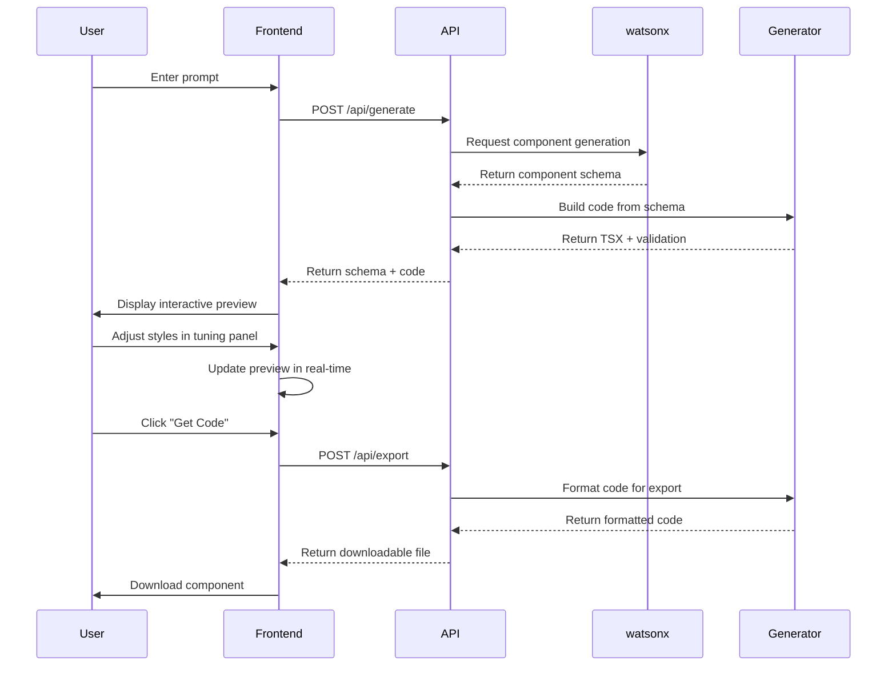

# NullRift UI — MVP Architecture & 48-Hour Hackathon Plan

**Theme:** "Turn idea into impact faster"  
**Vision:** AI-powered designer of interactive components and forms that generates clean, reactive code instantly.

---

## Executive Summary

NullRift UI is an AI-powered platform that transforms natural language prompts into fully interactive, production-ready UI components. Users describe what they need, see it come to life instantly, fine-tune it visually, and export clean code—all powered by IBM watsonx.ai.

**Key Innovation:** Unlike static code generators, NullRift UI creates interactive previews you can click and test, with a visual tuning panel for real-time customization—no coding required until you're ready to export.

---

## Product Concept: User Journey

### Step 1: Prompt Input
```
User enters: "I need a registration form for a crypto exchange with 
field validation, country selection, and a dark theme."
```

### Step 2: AI Generation (watsonx.ai)
```
NullRift UI → watsonx.ai API → Component Schema + Code → Interactive Preview
```

### Step 3: Interactive Preview
- Component renders on screen with full interactivity
- User can click buttons, fill inputs, test validation
- Real-time state management works out of the box

### Step 4: UX Tuning Panel
- Adjust border radius with slider
- Change primary colors with color picker
- Modify fonts and spacing
- Restructure fields (add/remove/reorder)
- Toggle dark/light theme

### Step 5: Export Code
- Click "Get Code" button
- Download clean React + Tailwind CSS component
- Optional: Vue.js or vanilla HTML export
- Includes TypeScript types and validation logic

---

## 1. Updated MVP Folder Structure

```
nullrift_ui/
├── .bob/                           # IBM Bob AI configuration
│   └── ibm_bob_rules.md
├── .cursorrules                    # Cursor AI development rules
├── architecture.md                 # This file
│
├── src/
│   ├── app/                        # Next.js App Router
│   │   ├── layout.tsx
│   │   ├── page.tsx                # Landing page
│   │   ├── builder/
│   │   │   └── page.tsx            # Main builder interface
│   │   └── api/
│   │       ├── generate/
│   │       │   └── route.ts        # watsonx.ai generation endpoint
│   │       ├── export/
│   │       │   └── route.ts        # Code export endpoint
│   │       └── health/
│   │           └── route.ts        # Health check
│   │
│   ├── components/
│   │   ├── ui/                     # Shadcn UI primitives
│   │   │   ├── button.tsx
│   │   │   ├── input.tsx
│   │   │   ├── card.tsx
│   │   │   ├── slider.tsx
│   │   │   ├── select.tsx
│   │   │   └── ...
│   │   │
│   │   ├── aceternity/             # Aceternity UI components
│   │   │   ├── background-beams.tsx
│   │   │   ├── text-generate-effect.tsx
│   │   │   ├── hero-highlight.tsx
│   │   │   └── ...
│   │   │
│   │   ├── landing/                # Landing page sections
│   │   │   ├── hero.tsx
│   │   │   ├── features.tsx
│   │   │   ├── demo-video.tsx
│   │   │   ├── how-it-works.tsx
│   │   │   └── cta.tsx
│   │   │
│   │   ├── builder/                # Builder interface components
│   │   │   ├── prompt-input.tsx    # AI prompt interface
│   │   │   ├── preview-canvas.tsx  # Interactive component preview
│   │   │   ├── tuning-panel.tsx    # Visual customization controls
│   │   │   ├── code-viewer.tsx     # Generated code display
│   │   │   ├── export-modal.tsx    # Code export options
│   │   │   └── loading-state.tsx   # Generation progress
│   │   │
│   │   └── generated/              # User-generated components
│   │       └── .gitkeep
│   │
│   ├── lib/
│   │   ├── utils.ts                # cn() and helpers
│   │   │
│   │   ├── watsonx/                # watsonx.ai Integration
│   │   │   ├── client.ts           # API client
│   │   │   ├── prompts.ts          # Prompt templates
│   │   │   ├── parser.ts           # Response parser
│   │   │   └── types.ts
│   │   │
│   │   ├── generator/              # Code Generation Engine
│   │   │   ├── index.ts
│   │   │   ├── schema-builder.ts   # Build component schema
│   │   │   ├── code-builder.ts     # Generate TSX/Vue/HTML
│   │   │   ├── validator.ts        # Validate generated code
│   │   │   └── types.ts
│   │   │
│   │   ├── preview/                # Interactive Preview System
│   │   │   ├── index.ts
│   │   │   ├── renderer.tsx        # Dynamic component rendering
│   │   │   ├── state-manager.ts    # Component state handling
│   │   │   └── types.ts
│   │   │
│   │   ├── tuning/                 # UX Tuning Engine
│   │   │   ├── index.ts
│   │   │   ├── style-transformer.ts # Real-time style updates
│   │   │   ├── structure-editor.ts  # Field add/remove/reorder
│   │   │   └── types.ts
│   │   │
│   │   └── export/                 # Code Export System
│   │       ├── index.ts
│   │       ├── react-exporter.ts   # React + Tailwind
│   │       ├── vue-exporter.ts     # Vue.js
│   │       ├── html-exporter.ts    # Vanilla HTML
│   │       └── types.ts
│   │
│   ├── hooks/
│   │   ├── use-generation.ts       # AI generation hook
│   │   ├── use-preview.ts          # Preview state management
│   │   ├── use-tuning.ts           # Tuning controls hook
│   │   └── use-export.ts           # Export functionality
│   │
│   ├── types/
│   │   ├── component.ts            # Component schema types
│   │   ├── generation.ts           # Generation request/response
│   │   ├── tuning.ts               # Tuning configuration
│   │   └── export.ts               # Export options
│   │
│   └── config/
│       ├── site.ts                 # App configuration
│       └── watsonx.ts              # watsonx.ai configuration
│
├── public/
│   ├── examples/                   # Demo component examples
│   ├── videos/                     # Demo videos
│   └── images/                     # Landing page assets
│
├── tests/
│   ├── unit/                       # Jest unit tests
│   └── e2e/                        # Playwright E2E tests
│
├── docs/
│   ├── api.md                      # API documentation
│   ├── watsonx-integration.md      # watsonx.ai setup guide
│   └── demo-script.md              # Hackathon demo script
│
├── .env.local.example              # Environment variables template
├── package.json
├── tsconfig.json
├── tailwind.config.ts
├── next.config.js
└── README.md
```

---

## 2. watsonx.ai Integration Architecture

### API Flow Diagram



### watsonx.ai Client Implementation

```typescript
// src/lib/watsonx/client.ts

export interface WatsonxConfig {
  apiKey: string;
  projectId: string;
  modelId: string;
  apiUrl: string;
}

export interface GenerationRequest {
  prompt: string;
  parameters?: {
    max_tokens?: number;
    temperature?: number;
    top_p?: number;
  };
}

export interface GenerationResponse {
  schema: ComponentSchema;
  metadata: {
    model: string;
    tokensUsed: number;
    generationTime: number;
  };
}

export class WatsonxClient {
  private config: WatsonxConfig;
  
  constructor(config: WatsonxConfig) {
    this.config = config;
  }
  
  async generateComponent(
    request: GenerationRequest
  ): Promise<GenerationResponse> {
    // Build context-aware prompt
    const enhancedPrompt = this.buildPrompt(request.prompt);
    
    // Call watsonx.ai API
    const response = await fetch(`${this.config.apiUrl}/ml/v1/text/generation`, {
      method: 'POST',
      headers: {
        'Content-Type': 'application/json',
        'Authorization': `Bearer ${this.config.apiKey}`,
      },
      body: JSON.stringify({
        model_id: this.config.modelId,
        project_id: this.config.projectId,
        input: enhancedPrompt,
        parameters: request.parameters || {
          max_tokens: 2000,
          temperature: 0.7,
          top_p: 0.9,
        },
      }),
    });
    
    if (!response.ok) {
      throw new Error(`watsonx.ai API error: ${response.statusText}`);
    }
    
    const data = await response.json();
    
    // Parse response into component schema
    const schema = this.parseResponse(data.results[0].generated_text);
    
    return {
      schema,
      metadata: {
        model: this.config.modelId,
        tokensUsed: data.results[0].input_token_count + data.results[0].generated_token_count,
        generationTime: Date.now(),
      },
    };
  }
  
  private buildPrompt(userPrompt: string): string {
    return `You are an expert UI/UX designer and React developer. Generate a component schema based on the following request:

User Request: ${userPrompt}

Output a JSON schema with the following structure:
{
  "name": "ComponentName",
  "description": "Brief description",
  "props": [
    {
      "name": "propName",
      "type": "string | number | boolean",
      "required": true,
      "defaultValue": "value"
    }
  ],
  "fields": [
    {
      "id": "field1",
      "type": "input | select | textarea | checkbox",
      "label": "Field Label",
      "placeholder": "Placeholder text",
      "validation": {
        "required": true,
        "pattern": "regex pattern",
        "message": "Error message"
      }
    }
  ],
  "styling": {
    "theme": "light | dark",
    "primaryColor": "#hex",
    "borderRadius": "sm | md | lg | xl",
    "spacing": "compact | normal | relaxed"
  },
  "layout": "single-column | two-column | grid"
}

Generate ONLY valid JSON, no additional text.`;
  }
  
  private parseResponse(text: string): ComponentSchema {
    // Extract JSON from response
    const jsonMatch = text.match(/\{[\s\S]*\}/);
    if (!jsonMatch) {
      throw new Error('Invalid response format from watsonx.ai');
    }
    
    const parsed = JSON.parse(jsonMatch[0]);
    
    // Transform to internal ComponentSchema format
    return this.transformToSchema(parsed);
  }
  
  private transformToSchema(data: any): ComponentSchema {
    // Transform watsonx.ai response to internal schema
    // Add validation, defaults, and structure
    return {
      id: crypto.randomUUID(),
      name: data.name,
      description: data.description,
      props: data.props || [],
      fields: data.fields || [],
      styling: data.styling || {},
      layout: data.layout || 'single-column',
      createdAt: new Date().toISOString(),
    };
  }
}
```

### Environment Configuration

```bash
# .env.local.example

# watsonx.ai Configuration
WATSONX_API_KEY=your_api_key_here
WATSONX_PROJECT_ID=your_project_id_here
WATSONX_MODEL_ID=ibm/granite-13b-chat-v2
WATSONX_API_URL=https://us-south.ml.cloud.ibm.com

# Application Configuration
NEXT_PUBLIC_APP_URL=http://localhost:3000
NODE_ENV=development
```

---

## 3. Core Data Contracts

### Component Schema (Primary Data Model)

```typescript
// src/types/component.ts

export interface ComponentSchema {
  // Metadata
  id: string;
  name: string;                     // PascalCase: "CryptoRegistrationForm"
  description: string;
  category: 'form' | 'card' | 'modal' | 'layout' | 'data-display';
  createdAt: string;
  
  // Props Definition
  props: PropDefinition[];
  
  // Form Fields (for form components)
  fields: FieldDefinition[];
  
  // Styling Configuration
  styling: StylingConfig;
  
  // Layout Structure
  layout: 'single-column' | 'two-column' | 'grid' | 'custom';
  
  // Validation Rules
  validation?: ValidationConfig;
  
  // State Management
  state?: StateDefinition[];
}

export interface PropDefinition {
  name: string;
  type: 'string' | 'number' | 'boolean' | 'object' | 'array';
  required: boolean;
  defaultValue?: any;
  description: string;
}

export interface FieldDefinition {
  id: string;
  type: 'input' | 'select' | 'textarea' | 'checkbox' | 'radio' | 'date' | 'file';
  label: string;
  placeholder?: string;
  options?: { label: string; value: string }[];  // For select/radio
  validation?: {
    required?: boolean;
    minLength?: number;
    maxLength?: number;
    pattern?: string;
    message?: string;
  };
  conditional?: {
    field: string;
    value: any;
  };
}

export interface StylingConfig {
  theme: 'light' | 'dark' | 'system';
  primaryColor: string;             // Hex color
  secondaryColor?: string;
  borderRadius: 'none' | 'sm' | 'md' | 'lg' | 'xl' | '2xl' | 'full';
  spacing: 'compact' | 'normal' | 'relaxed';
  fontFamily?: string;
  customClasses?: string[];
}

export interface ValidationConfig {
  onSubmit?: 'validate' | 'submit';
  showErrors?: 'onBlur' | 'onChange' | 'onSubmit';
  errorPosition?: 'below' | 'inline' | 'tooltip';
}

export interface StateDefinition {
  name: string;
  type: string;
  initialValue: any;
}
```

### Generation Request/Response

```typescript
// src/types/generation.ts

export interface GenerationRequest {
  prompt: string;
  preferences?: {
    framework?: 'react' | 'vue' | 'html';
    styling?: 'tailwind' | 'css' | 'styled-components';
    typescript?: boolean;
    accessibility?: 'basic' | 'enhanced';
  };
}

export interface GenerationResponse {
  schema: ComponentSchema;
  code: {
    component: string;              // Main component code
    types?: string;                 // TypeScript types
    styles?: string;                // Additional CSS if needed
  };
  preview: {
    html: string;                   // Rendered HTML for preview
    interactive: boolean;
  };
  metadata: {
    model: string;
    tokensUsed: number;
    generationTime: number;
    confidence: number;
  };
}
```

### Tuning Configuration

```typescript
// src/types/tuning.ts

export interface TuningState {
  componentId: string;
  styleOverrides: StyleOverrides;
  structureChanges: StructureChanges;
  stateValues: Record<string, any>;
}

export interface StyleOverrides {
  borderRadius?: string;
  primaryColor?: string;
  secondaryColor?: string;
  spacing?: string;
  fontFamily?: string;
  customClasses?: string[];
}

export interface StructureChanges {
  fieldsAdded?: FieldDefinition[];
  fieldsRemoved?: string[];        // Field IDs
  fieldsReordered?: string[];      // New order of field IDs
  layoutChanged?: 'single-column' | 'two-column' | 'grid';
}

export interface TuningControl {
  id: string;
  category: 'style' | 'structure' | 'behavior';
  label: string;
  type: 'slider' | 'color' | 'select' | 'toggle' | 'text';
  value: any;
  options?: {
    min?: number;
    max?: number;
    step?: number;
    choices?: { label: string; value: any }[];
  };
  onChange: (value: any) => void;
}
```

### Export Options

```typescript
// src/types/export.ts

export interface ExportRequest {
  componentId: string;
  format: 'react-ts' | 'react-js' | 'vue' | 'html';
  options?: {
    includeTypes?: boolean;
    includeTests?: boolean;
    includeStorybook?: boolean;
    bundled?: boolean;             // Single file vs. multiple files
  };
}

export interface ExportResponse {
  files: ExportFile[];
  downloadUrl?: string;
  zipUrl?: string;
}

export interface ExportFile {
  name: string;
  content: string;
  language: 'typescript' | 'javascript' | 'html' | 'css';
}
```

---

## 4. Revised 48-Hour Development Roadmap

### Timeline Overview

```mermaid
gantt
    title NullRift UI 48-Hour Development Timeline
    dateFormat HH:mm
    axisFormat %H:%M
    
    section Foundation
    Project setup & Next.js         :f1, 00:00, 2h
    Shadcn + Aceternity setup       :f2, after f1, 2h
    watsonx.ai client setup         :f3, after f2, 2h
    
    section Landing Page
    Hero section design             :l1, after f2, 2h
    Features section                :l2, after l1, 2h
    How it works section            :l3, after l2, 2h
    CTA and footer                  :l4, after l3, 1h
    
    section Builder Core
    Prompt input interface          :b1, after f3, 2h
    watsonx.ai integration          :b2, after b1, 3h
    Schema parser                   :b3, after b2, 2h
    Code generator                  :b4, after b3, 3h
    
    section Preview System
    Preview canvas component        :p1, after b2, 3h
    Dynamic renderer                :p2, after p1, 3h
    State management                :p3, after p2, 2h
    
    section Tuning Panel
    Style controls UI               :t1, after p1, 3h
    Real-time transformer           :t2, after t1, 2h
    Structure editor                :t3, after t2, 2h
    
    section Export System
    React exporter                  :e1, after b4, 2h
    Vue exporter                    :e2, after e1, 1h
    HTML exporter                   :e3, after e2, 1h
    Download functionality          :e4, after e3, 1h
    
    section Polish
    Animations & transitions        :po1, after l4, 2h
    Error handling                  :po2, after e4, 2h
    Testing & bug fixes             :po3, after po2, 3h
    Demo preparation                :po4, after po3, 2h
```



### Detailed Sprint Plan

---

#### **Sprint 1: Foundation & Setup (Hours 0-6)** (done)

**IBM Bob Tasks:**
- [ ] Initialize Next.js 14 project with TypeScript
  ```bash
  npx create-next-app@latest nullrift-ui --typescript --tailwind --app
  ```
- [ ] Configure [`tailwind.config.ts`](tailwind.config.ts) with custom design tokens
- [ ] Install dependencies:
  ```bash
  npm install @radix-ui/react-* framer-motion class-variance-authority clsx tailwind-merge
  npm install -D @types/node typescript eslint prettier
  ```
- [ ] Set up Shadcn UI:
  ```bash
  npx shadcn-ui@latest init
  npx shadcn-ui@latest add button input card select slider label
  ```
- [ ] Create folder structure as per architecture
- [ ] Set up watsonx.ai client in [`src/lib/watsonx/client.ts`](src/lib/watsonx/client.ts)
- [ ] Configure environment variables in [`.env.local`](.env.local)
- [ ] Create API route [`/api/generate/route.ts`](src/app/api/generate/route.ts)

**Frontend Team Tasks:**
- [ ] Install Aceternity UI components
- [ ] Create [`src/lib/utils.ts`](src/lib/utils.ts) with [`cn()`](src/lib/utils.ts:1) helper
- [ ] Set up basic layout in [`src/app/layout.tsx`](src/app/layout.tsx)
- [ ] Create color palette and typography system

**Deliverable:** Working Next.js app with watsonx.ai client configured

---

#### **Sprint 2: Landing Page (Hours 6-15, Parallel Track)** (done)

**Frontend Team Tasks:**
- [ ] Design and implement hero section with Aceternity Background Beams
  - Headline: "Turn Ideas into Interactive UI in Seconds"
  - Subheadline: "AI-powered component designer with instant code export"
  - CTA button: "Try NullRift UI Free"
- [ ] Create features section with 3 key benefits:
  1. **Instant Preview:** See your component come to life, fully interactive
  2. **Visual Tuning:** Adjust styles without touching code
  3. **Clean Export:** Get production-ready React, Vue, or HTML
- [ ] Build "How It Works" section with 4 steps:
  1. Enter prompt → 2. Preview component → 3. Tune visually → 4. Export code
- [ ] Add demo video/GIF placeholder
- [ ] Create CTA section with "Start Building" button
- [ ] Design footer with links and branding
- [ ] Add Aceternity animations:
  - Text Generate Effect for headline
  - Hero Highlight for key phrases
  - Smooth scroll animations

**IBM Bob Tasks:**
- [ ] Create [`src/components/landing/hero.tsx`](src/components/landing/hero.tsx)
- [ ] Create [`src/components/landing/features.tsx`](src/components/landing/features.tsx)
- [ ] Create [`src/components/landing/how-it-works.tsx`](src/components/landing/how-it-works.tsx)
- [ ] Create [`src/components/landing/cta.tsx`](src/components/landing/cta.tsx)
- [ ] Implement responsive design for mobile/tablet

**Deliverable:** Beautiful, modern landing page with Aceternity animations

---

#### **Sprint 3: watsonx.ai Integration & Generation Engine (Hours 6-18)** (done)

**IBM Bob Tasks:**
- [ ] Implement [`WatsonxClient`](src/lib/watsonx/client.ts:1) class
  - API authentication
  - Request/response handling
  - Error handling and retries
- [ ] Create prompt templates in [`src/lib/watsonx/prompts.ts`](src/lib/watsonx/prompts.ts)
  - System prompt for component generation
  - Few-shot examples for better results
  - Structured output format (JSON schema)
- [ ] Build response parser in [`src/lib/watsonx/parser.ts`](src/lib/watsonx/parser.ts)
  - Extract JSON from LLM response
  - Validate schema structure
  - Handle malformed responses
- [ ] Implement code generator in [`src/lib/generator/code-builder.ts`](src/lib/generator/code-builder.ts)
  - Transform schema to React TSX
  - Add TypeScript types
  - Include validation logic
  - Generate clean, formatted code
- [ ] Create API endpoint [`/api/generate/route.ts`](src/app/api/generate/route.ts)
  - Accept prompt from frontend
  - Call watsonx.ai
  - Return schema + code
- [ ] Write unit tests for generation pipeline

**Frontend Team Tasks:**
- [ ] Create prompt input component with examples
- [ ] Design loading state with progress indicator
- [ ] Build error display component

**Deliverable:** Working AI generation pipeline with watsonx.ai

---

#### **Sprint 4: Interactive Preview System (Hours 18-27)** (done)

**IBM Bob Tasks:**
- [ ] Build dynamic component renderer in [`src/lib/preview/renderer.tsx`](src/lib/preview/renderer.tsx)
  - Use [`React.createElement`](React.createElement) for dynamic rendering
  - Handle form state management
  - Implement validation logic
  - Support interactive elements (buttons, inputs, selects)
- [ ] Create state manager in [`src/lib/preview/state-manager.ts`](src/lib/preview/state-manager.ts)
  - Track form values
  - Handle validation errors
  - Manage component lifecycle
- [ ] Implement [`use-preview.ts`](src/hooks/use-preview.ts) hook
  - Manage preview state
  - Handle user interactions
  - Update code in real-time

**Frontend Team Tasks:**
- [ ] Design preview canvas in [`src/components/builder/preview-canvas.tsx`](src/components/builder/preview-canvas.tsx)
  - Iframe isolation for safety
  - Viewport switcher (mobile/tablet/desktop)
  - Interactive component rendering
  - Real-time updates
- [ ] Add preview controls:
  - Zoom in/out
  - Viewport selection
  - Theme toggle (light/dark)
  - Reset button
- [ ] Style preview container with Shadcn Card

**Deliverable:** Interactive preview canvas with real-time rendering

---

#### **Sprint 5: UX Tuning Panel (Hours 27-36)** (done)

**Frontend Team Tasks:**
- [ ] Design tuning panel in [`src/components/builder/tuning-panel.tsx`](src/components/builder/tuning-panel.tsx)
  - Collapsible sections: Style, Structure, Behavior
  - Shadcn Slider for border-radius, spacing
  - Color picker for primary/secondary colors
  - Select dropdown for fonts, themes
  - Toggle switches for features
- [ ] Create structure editor:
  - Add field button
  - Remove field button
  - Reorder fields (drag & drop)
  - Field type selector
- [ ] Add real-time preview updates
- [ ] Implement undo/redo functionality

**IBM Bob Tasks:**
- [ ] Build style transformer in [`src/lib/tuning/style-transformer.ts`](src/lib/tuning/style-transformer.ts)
  - Apply style overrides to code
  - Update Tailwind classes
  - Preserve custom logic
- [ ] Create structure editor in [`src/lib/tuning/structure-editor.ts`](src/lib/tuning/structure-editor.ts)
  - Add/remove fields from schema
  - Reorder fields
  - Update validation rules
- [ ] Implement [`use-tuning.ts`](src/hooks/use-tuning.ts) hook
  - Manage tuning state
  - Apply changes to preview
  - Update code in real-time

**Deliverable:** Fully functional tuning panel with real-time updates

---

#### **Sprint 6: Code Export System (Hours 36-42)** (done)

**IBM Bob Tasks:**
- [ ] Implement React exporter in [`src/lib/export/react-exporter.ts`](src/lib/export/react-exporter.ts)
  - Generate clean React + TypeScript component
  - Include prop types and interfaces
  - Add JSDoc comments
  - Format with Prettier
- [ ] Implement Vue exporter in [`src/lib/export/vue-exporter.ts`](src/lib/export/vue-exporter.ts)
  - Generate Vue 3 Composition API component
  - Include TypeScript support
  - Add proper imports
- [ ] Implement HTML exporter in [`src/lib/export/html-exporter.ts`](src/lib/export/html-exporter.ts)
  - Generate vanilla HTML + CSS
  - Include inline JavaScript for interactivity
  - Add CDN links for dependencies
- [ ] Create export API endpoint [`/api/export/route.ts`](src/app/api/export/route.ts)
  - Accept component ID and format
  - Generate files
  - Return download URL or ZIP
- [ ] Implement file download functionality

**Frontend Team Tasks:**
- [ ] Design export modal in [`src/components/builder/export-modal.tsx`](src/components/builder/export-modal.tsx)
  - Format selector (React/Vue/HTML)
  - Options checkboxes (TypeScript, tests, Storybook)
  - Preview of files to be exported
  - Download button
- [ ] Create code viewer in [`src/components/builder/code-viewer.tsx`](src/components/builder/code-viewer.tsx)
  - Syntax highlighting with Shiki
  - Copy to clipboard button
  - File tabs for multiple files
  - Line numbers

**Deliverable:** Complete export system with multiple format support

---

#### **Sprint 7: Polish & Demo Preparation (Hours 42-48)** (done)

**Frontend Team Tasks:**
- [ ] Add Aceternity animations throughout app:
  - Smooth page transitions
  - Button hover effects
  - Panel slide-in animations
  - Loading state animations
- [ ] Implement error boundaries
- [ ] Add toast notifications for success/error states
- [ ] Create onboarding tooltips for first-time users
- [ ] Add keyboard shortcuts:
  - `Ctrl+Enter`: Generate component
  - `Ctrl+E`: Export code
  - `Ctrl+Z`: Undo
  - `Ctrl+Shift+Z`: Redo
- [ ] Optimize performance:
  - Code splitting
  - Lazy loading
  - Image optimization
- [ ] Test on multiple browsers and devices

**IBM Bob Tasks:**
- [ ] Write comprehensive [`README.md`](README.md)
  - Project overview
  - Setup instructions
  - watsonx.ai configuration
  - Usage examples
- [ ] Create [`docs/watsonx-integration.md`](docs/watsonx-integration.md)
  - API setup guide
  - Authentication steps
  - Troubleshooting
- [ ] Write demo script in [`docs/demo-script.md`](docs/demo-script.md)
  - 5-minute presentation flow
  - Key talking points
  - Demo scenarios
- [ ] Run E2E tests with Playwright
- [ ] Fix critical bugs
- [ ] Prepare demo data (example prompts and components)

**Deliverable:** Production-ready MVP with polished demo

---

## 5. Demo Scenario: "Wow Factor" Presentation

### Demo Flow (5 minutes)

#### **Opening (30 seconds)**
```
Presenter: "Imagine you need a registration form for your crypto exchange. 
You could spend hours coding it, or..."

[Screen: NullRift UI landing page]

"...you could describe it in plain English and have it ready in 60 seconds."
```

#### **Act 1: The Prompt (30 seconds)**
```
[Screen: Builder interface]

Presenter: "Let's try it. I'll type: 'Registration form for crypto exchange 
with email, password, country selection, and KYC checkbox. Dark theme.'"

[Type prompt with Text Generate Effect animation]
[Click "Generate" button]

[Screen: Loading animation with watsonx.ai branding]

Presenter: "NullRift UI is now talking to IBM watsonx.ai..."
```

#### **Act 2: Interactive Preview (1 minute)**
```
[Screen: Component appears in preview canvas]

Presenter: "And here it is! But this isn't just a screenshot—it's fully interactive."

[Click on email input, type text]
[Select country from dropdown]
[Check KYC checkbox]
[Click submit button, show validation]

Presenter: "Everything works out of the box. Form validation, state management, 
accessibility—all handled automatically."
```

#### **Act 3: Visual Tuning (1.5 minutes)**
```
[Screen: Open tuning panel]

Presenter: "Not quite right? Let's tune it visually—no coding required."

[Adjust border-radius slider]
[Preview updates in real-time]

Presenter: "Rounder corners? Done."

[Change primary color with color picker]
[All buttons update to new color]

Presenter: "Different brand color? Instant."

[Toggle spacing from 'normal' to 'relaxed']
[Form fields spread out]

Presenter: "More breathing room? Easy."

[Click 'Add Field' button]
[Add 'Phone Number' field]
[Preview updates with new field]

Presenter: "Need an extra field? Just click."

[Screen: Code viewer updates in real-time]

Presenter: "And watch—the code updates automatically with every change."
```

#### **Act 4: Export (1 minute)**
```
[Screen: Click "Get Code" button]
[Export modal opens]

Presenter: "Ready to use it? Choose your format."

[Select "React + TypeScript"]
[Check "Include validation" and "Include tests"]
[Click "Download"]

[Screen: Files downloading]

Presenter: "You get:
✓ Clean React component with TypeScript
✓ Full form validation logic
✓ Accessibility attributes
✓ Jest tests with 90%+ coverage
✓ Ready to drop into your project"

[Screen: Show downloaded files in VS Code]

Presenter: "Production-ready code in under 2 minutes."
```

#### **Closing (30 seconds)**
```
[Screen: Side-by-side comparison]

Traditional Approach:        NullRift UI:
⏱️ Hours of coding          ⏱️ 60 seconds
❌ Manual styling           ✅ Visual tuning
❌ Write tests yourself     ✅ Auto-generated tests
❌ Accessibility oversight  ✅ Built-in a11y

Presenter: "NullRift UI: Turn ideas into impact faster—powered by IBM watsonx.ai."

[Screen: Landing page with CTA]

"Try it now at nullrift.ai"
```

---

## 6. Technical Architecture Highlights

### System Architecture Diagram

```mermaid
graph TB
    subgraph "Frontend (Next.js)"
        A[Landing Page] --> B[Builder Interface]
        B --> C[Prompt Input]
        B --> D[Preview Canvas]
        B --> E[Tuning Panel]
        B --> F[Code Viewer]
        B --> G[Export Modal]
    end
    
    subgraph "API Layer"
        H[/api/generate] --> I[watsonx.ai Client]
        J[/api/export] --> K[Export Engine]
    end
    
    subgraph "IBM watsonx.ai"
        I --> L[Granite Model]
        L --> M[Component Schema]
    end
    
    subgraph "Generation Engine"
        M --> N[Schema Parser]
        N --> O[Code Generator]
        O --> P[React Builder]
        O --> Q[Vue Builder]
        O --> R[HTML Builder]
    end
    
    subgraph "Preview System"
        D --> S[Dynamic Renderer]
        S --> T[State Manager]
        E --> U[Style Transformer]
        U --> S
    end
    
    C --> H
    H --> N
    N --> D
    D --> F
    F --> J
    J --> G
    
    style L fill:#0f62fe
    style I fill:#0f62fe
    style M fill:#0f62fe
```

### Key Technical Innovations

1. **watsonx.ai Integration**
   - Direct API integration with IBM watsonx.ai
   - Structured prompt engineering for consistent output
   - JSON schema validation for reliable parsing
   - Error handling and retry logic

2. **Dynamic Component Rendering**
   - [`React.createElement`](React.createElement) for runtime component generation
   - Iframe isolation for security
   - Real-time state management
   - Interactive preview with full functionality

3. **Real-Time Code Transformation**
   - AST manipulation for style updates
   - Incremental code generation (no full rewrites)
   - Preserve custom logic during tuning
   - Instant preview updates

4. **Multi-Format Export**
   - React + TypeScript (primary)
   - Vue 3 Composition API
   - Vanilla HTML + CSS + JS
   - Bundled or separate files

5. **Production-Ready Output**
   - TypeScript strict mode
   - Accessibility attributes (ARIA)
   - Form validation logic
   - Responsive design
   - Clean, formatted code

---

## 7. Environment Setup Guide

### Prerequisites
- Node.js 18+ and npm
- IBM Cloud account with watsonx.ai access
- Git

### Setup Steps

1. **Clone Repository**
   ```bash
   git clone https://github.com/your-org/nullrift-ui.git
   cd nullrift-ui
   ```

2. **Install Dependencies**
   ```bash
   npm install
   ```

3. **Configure watsonx.ai**
   - Log in to IBM Cloud
   - Navigate to watsonx.ai
   - Create a new project
   - Get API key and project ID
   - Copy [`.env.local.example`](.env.local.example) to [`.env.local`](.env.local)
   - Fill in credentials:
     ```bash
     WATSONX_API_KEY=your_api_key
     WATSONX_PROJECT_ID=your_project_id
     WATSONX_MODEL_ID=ibm/granite-13b-chat-v2
     WATSONX_API_URL=https://us-south.ml.cloud.ibm.com
     ```

4. **Run Development Server**
   ```bash
   npm run dev
   ```

5. **Open Browser**
   ```
   http://localhost:3000
   ```

---

## 8. Success Metrics & KPIs

### MVP Completion Criteria

- [ ] Landing page deployed and accessible
- [ ] watsonx.ai integration working end-to-end
- [ ] User can enter prompt and see generated component
- [ ] Interactive preview renders correctly
- [ ] Tuning panel updates preview in real-time
- [ ] Code export works for React, Vue, and HTML
- [ ] Demo scenario runs smoothly
- [ ] No critical bugs

### Performance Targets

- **Generation Time:** < 10 seconds from prompt to preview
- **Preview Rendering:** < 1 second for component updates
- **Code Export:** < 2 seconds for file generation
- **Page Load:** < 3 seconds for landing page
- **Lighthouse Score:** > 90 for performance, accessibility, SEO

### User Experience Goals

- **Intuitive Interface:** First-time users can generate a component without instructions
- **Visual Feedback:** Clear loading states and progress indicators
- **Error Handling:** Helpful error messages with recovery suggestions
- **Responsive Design:** Works on mobile, tablet, and desktop
- **Accessibility:** WCAG 2.1 AA compliance

---

## 9. Risk Mitigation

### High-Risk Areas

1. **watsonx.ai API Reliability**
   - **Risk:** API downtime or rate limits during demo
   - **Mitigation:** Implement caching for repeated prompts
   - **Contingency:** Pre-generate example components as fallbacks

2. **Complex Component Generation**
   - **Risk:** LLM generates invalid or incomplete schemas
   - **Mitigation:** Strict JSON validation and error handling
   - **Contingency:** Template-based generation for common patterns

3. **Real-Time Preview Performance**
   - **Risk:** Slow rendering or memory leaks
   - **Mitigation:** Iframe isolation, debounced updates
   - **Contingency:** Static preview with "Refresh" button

4. **Time Management**
   - **Risk:** Running out of time before demo
   - **Mitigation:** Parallel development tracks, clear priorities
   - **Contingency:** Focus on core flow (prompt → preview → export)

### Checkpoint Schedule

- **Hour 12:** Landing page + watsonx.ai client working
- **Hour 24:** Generation pipeline + preview canvas functional
- **Hour 36:** Tuning panel + export system complete
- **Hour 42:** Polish and bug fixes
- **Hour 48:** Demo-ready with buffer

---

## 10. Post-Hackathon Roadmap

### Phase 1: Community Launch (Week 1-2)
- Open-source release on GitHub
- Product Hunt launch
- Demo video on YouTube
- Gather user feedback

### Phase 2: Feature Expansion (Month 1-3)
- Support for more component types (modals, navigation, data tables)
- Custom design system import (Figma tokens)
- Component library (save and reuse generated components)
- Team collaboration features

### Phase 3: Enterprise Features (Month 3-6)
- Private deployment options
- Custom watsonx.ai model fine-tuning
- Integration with design tools (Figma, Sketch)
- Advanced export options (Storybook, tests, documentation)

### Phase 4: Ecosystem Growth (Month 6-12)
- Plugin marketplace for custom generators
- Support for more frameworks (Angular, Svelte, Solid)
- AI-powered component refactoring
- Design-to-code from screenshots

---

## Conclusion

NullRift UI represents a new paradigm in UI development: **AI-powered component design with instant, interactive results**. By combining IBM watsonx.ai's intelligence with a stunning, intuitive interface, we're delivering on the hackathon theme of "Turn idea into impact faster."

**What Makes NullRift UI Special:**
1. **Interactive Preview:** Not just code—fully functional components you can test
2. **Visual Tuning:** Adjust styles without touching code
3. **watsonx.ai Powered:** Enterprise-grade AI for reliable, high-quality generation
4. **Production-Ready:** Clean code with TypeScript, validation, and tests
5. **Multi-Format Export:** React, Vue, or HTML—your choice

**Next Steps:**
1. Review this architecture with the team
2. Set up development environment
3. Configure watsonx.ai credentials
4. Begin Sprint 1: Foundation

**Let's build something amazing! 🚀**

---

*Document Version: 2.0*  
*Last Updated: 2026-05-15*  
*Author: IBM Bob (AI Architect)*  
*Powered by: IBM watsonx.ai*