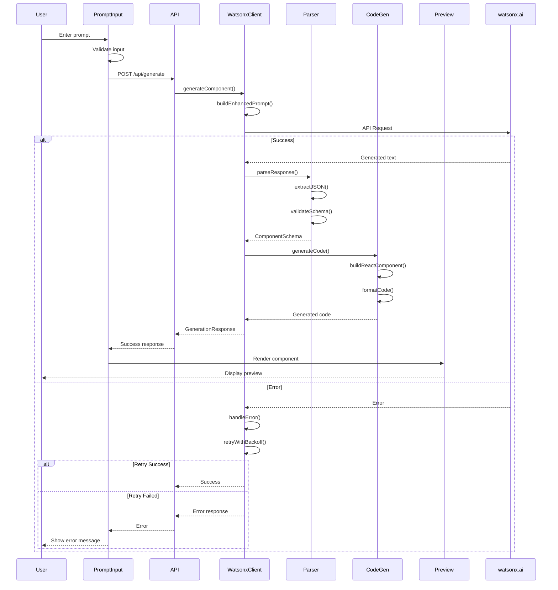
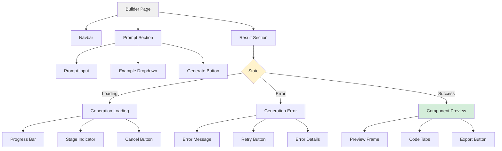
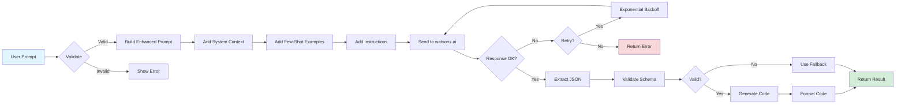
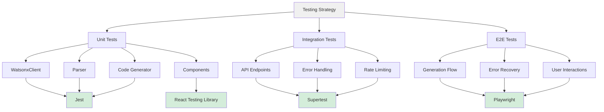
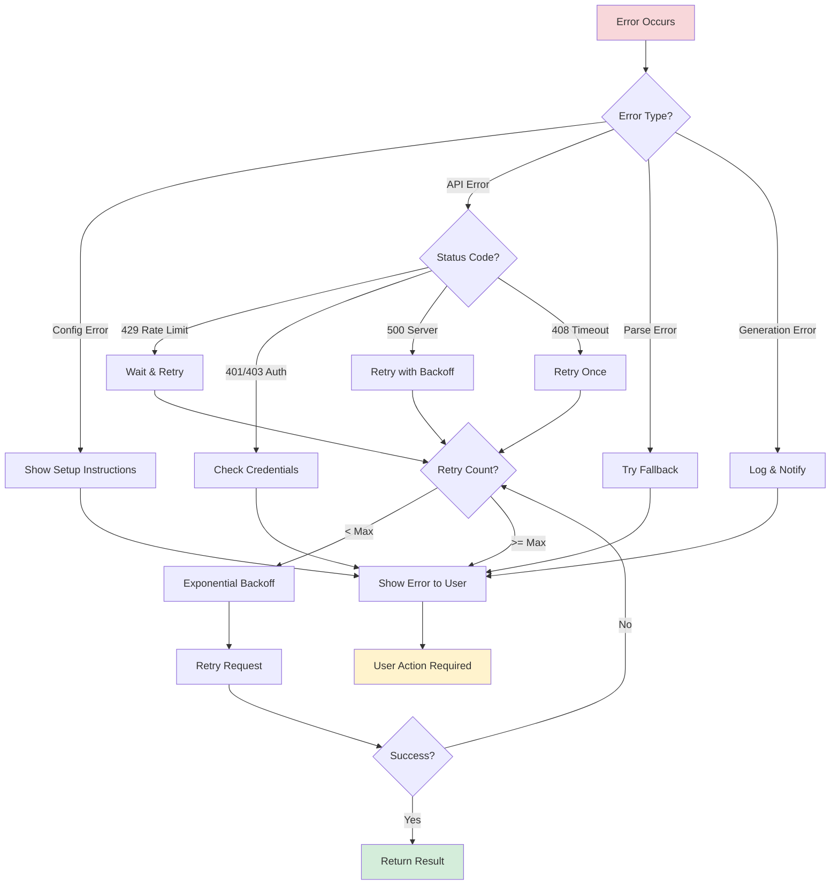
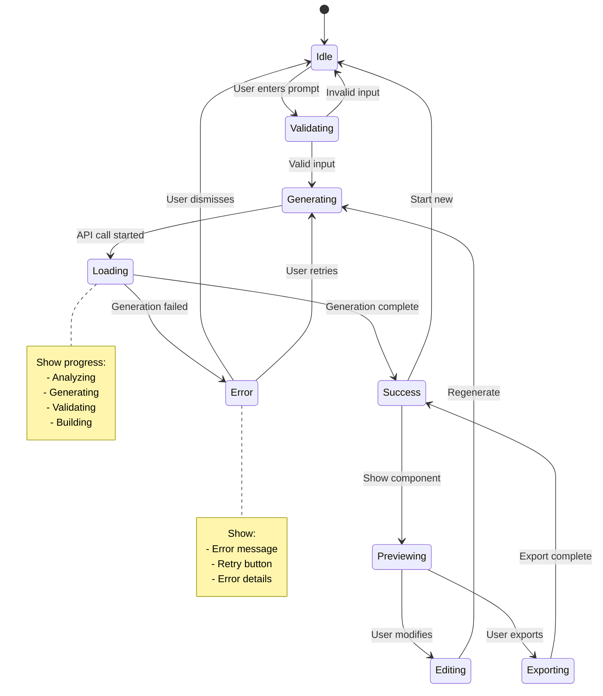
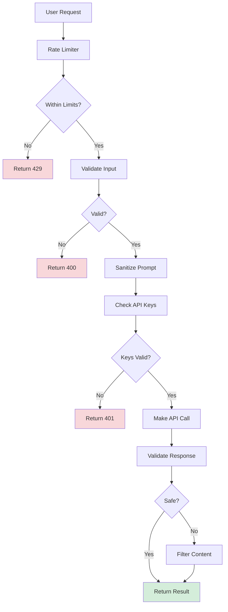
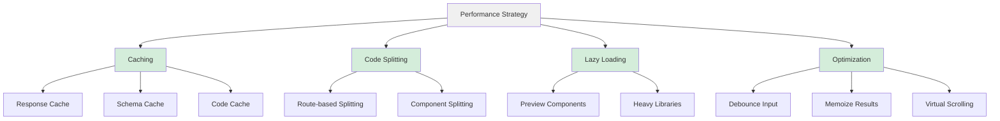

# Sprint 3: Development Workflow & Architecture

## 🔄 Complete Generation Flow



## 🏗️ System Architecture

```mermaid
graph TB
    subgraph Frontend
        A[Prompt Input] --> B[Loading State]
        B --> C[Preview/Error]
        D[Example Prompts] --> A
    end
    
    subgraph API Layer
        E[/api/generate] --> F[Request Validator]
        F --> G[Rate Limiter]
        G --> H[WatsonxClient]
    end
    
    subgraph Generation Pipeline
        H --> I[Prompt Builder]
        I --> J[watsonx.ai API]
        J --> K[Response Parser]
        K --> L[Schema Validator]
        L --> M[Code Generator]
    end
    
    subgraph Storage
        N[(Cache)] -.-> H
        O[(Logs)] -.-> E
    end
    
    A -->|POST| E
    M -->|Response| E
    E -->|JSON| C
    
    style A fill:#e1f5ff
    style M fill:#d4edda
    style J fill:#fff3cd
```

## 📊 Component Hierarchy



## 🔧 Data Flow



## 🎯 Implementation Phases

```mermaid
gantt
    title Sprint 3 Timeline (12 Hours)
    dateFormat HH
    axisFormat %H
    
    section Backend
    Enhance WatsonxClient     :a1, 06, 2h
    Create Prompt Templates   :a2, after a1, 2h
    Build Response Parser     :a3, after a2, 2h
    Implement Code Generator  :a4, after a3, 2h
    
    section Frontend
    Prompt Input Component    :b1, 10, 2h
    Loading State Component   :b2, after b1, 1h
    Error Display Component   :b3, after b2, 1h
    Builder Page Layout       :b4, after b3, 2h
    
    section Testing
    Unit Tests               :c1, 14, 1h
    Integration Tests        :c2, after c1, 1h
    E2E Tests               :c3, after c2, 1h
    
    section Polish
    Documentation           :d1, 17, 0.5h
    Performance Optimization :d2, after d1, 0.5h
```



## 🧪 Testing Strategy



## 🚨 Error Handling Flow



## 📦 Module Dependencies

```mermaid
graph LR
    A[Builder Page] --> B[Prompt Input]
    A --> C[Generation Loading]
    A --> D[Generation Error]
    A --> E[Component Preview]
    
    B --> F[/api/generate]
    F --> G[WatsonxClient]
    
    G --> H[Prompt Templates]
    G --> I[Response Parser]
    G --> J[watsonx.ai API]
    
    I --> K[Schema Validator]
    K --> L[Code Generator]
    
    L --> M[Code Formatters]
    L --> N[Template Engine]
    
    style A fill:#e1f5ff
    style F fill:#fff3cd
    style L fill:#d4edda
```

## 🎨 UI State Machine



## 🔐 Security Flow



## 📈 Performance Optimization



---

## 🎯 Key Takeaways

### Critical Path
1. **Prompt Engineering** → Better generation quality
2. **Error Handling** → Robust user experience
3. **Code Generation** → Production-ready output
4. **Testing** → Confidence in deployment

### Success Metrics
- ⚡ <2s API response time
- ✅ >95% parser success rate
- 🎨 Beautiful, responsive UI
- 🧪 >85% test coverage
- 📚 Complete documentation

### Risk Mitigation
- Implement retry logic early
- Add comprehensive error handling
- Test with various prompts
- Monitor API usage
- Cache successful generations

---

**Made with ❤️ by Bob**