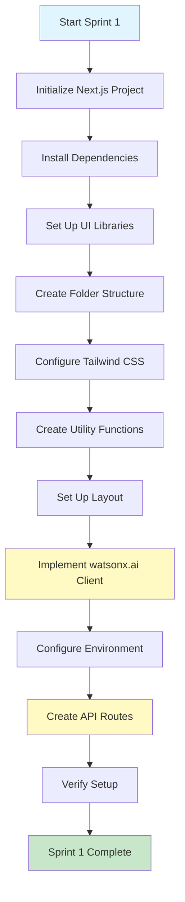
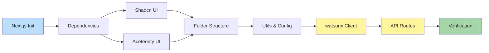
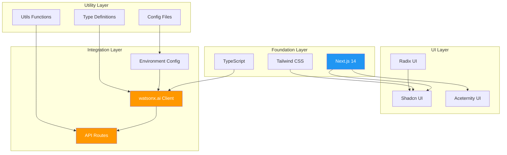
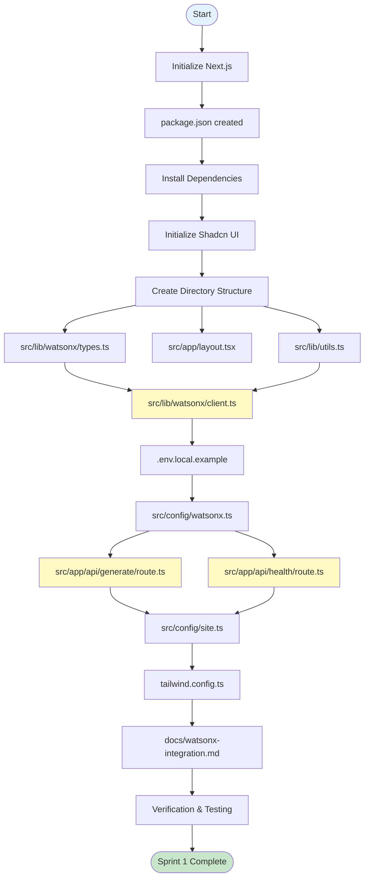
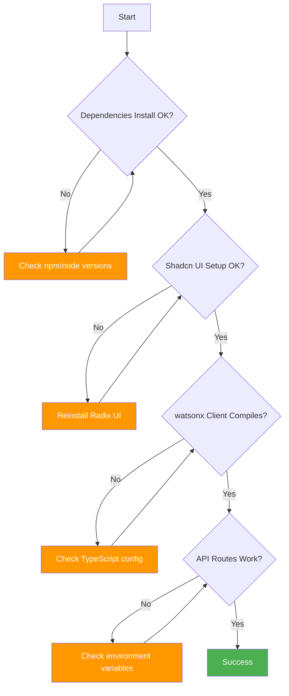
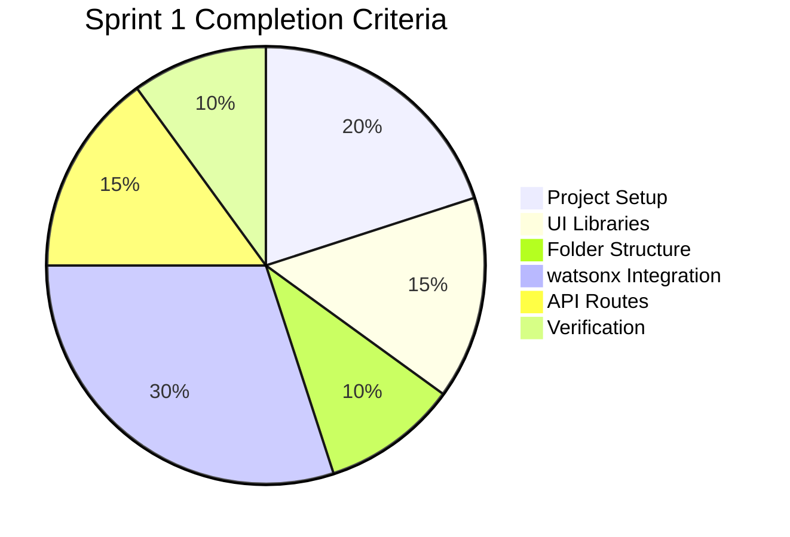
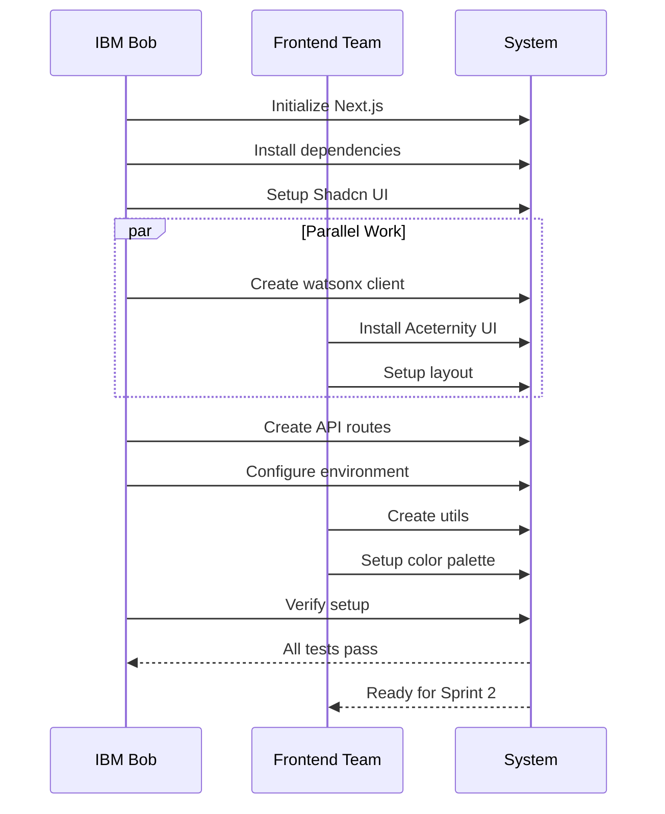

# Sprint 1 Workflow Diagram

## Execution Flow



## Dependency Chain



## Parallel Tasks

```mermaid
gantt
    title Sprint 1 Task Timeline
    dateFormat HH:mm
    axisFormat %H:%M
    
    section Setup
    Initialize Project           :00:00, 15m
    Install Dependencies         :00:15, 20m
    
    section UI Libraries
    Shadcn UI Setup             :00:35, 15m
    Aceternity UI Setup         :00:50, 20m
    
    section Structure
    Create Folders              :01:10, 30m
    Configure Tailwind          :01:40, 20m
    
    section Core Files
    Utils & Layout              :02:00, 25m
    watsonx Client              :02:25, 45m
    
    section Integration
    Environment Config          :03:10, 10m
    API Routes                  :03:20, 30m
    Documentation               :03:50, 15m
    
    section Verification
    Testing & Verification      :04:05, 15m
```



## Component Dependencies



## File Creation Order



## Critical Path

The critical path for Sprint 1 (tasks that cannot be parallelized):

1. **Initialize Next.js** (15 min) → Must be first
2. **Install Dependencies** (20 min) → Requires project
3. **Shadcn UI Setup** (15 min) → Requires dependencies
4. **Create Folder Structure** (30 min) → Requires project
5. **Create watsonx Client** (45 min) → Requires structure
6. **Create API Routes** (30 min) → Requires client
7. **Verification** (15 min) → Must be last

**Total Critical Path Time:** ~2h 50m

## Parallelizable Tasks

These tasks can be done in parallel after folder structure is created:

- Configure Tailwind CSS
- Create utility functions
- Set up basic layout
- Install Aceternity UI components
- Create documentation

**Time Saved:** ~1h 20m

## Risk Mitigation Points



## Checkpoint Schedule

| Time | Checkpoint | Verification |
|------|------------|--------------|
| 0:35 | Dependencies installed | `npm list --depth=0` |
| 1:10 | UI libraries ready | `npx shadcn-ui@latest add button` |
| 1:40 | Folder structure complete | `tree -L 3 src/` |
| 2:25 | Utils & layout working | `npm run type-check` |
| 3:10 | watsonx client implemented | TypeScript compiles |
| 3:50 | API routes created | `curl /api/health` |
| 4:20 | Full verification | Dev server runs |

## Success Metrics



## Team Coordination



---

## Quick Reference Commands

### Setup Phase
```bash
# Initialize project
npx create-next-app@latest nullrift-ui --typescript --tailwind --app

# Install dependencies
npm install @radix-ui/react-slot framer-motion class-variance-authority clsx tailwind-merge

# Setup Shadcn UI
npx shadcn-ui@latest init
npx shadcn-ui@latest add button input card select slider label
```

### Verification Phase
```bash
# Type check
npm run type-check

# Lint check
npm run lint

# Start dev server
npm run dev

# Test health endpoint
curl http://localhost:3000/api/health
```

### Troubleshooting
```bash
# Clear cache
rm -rf .next node_modules
npm install

# Check Node version
node --version  # Should be 18.x or higher

# Check npm version
npm --version   # Should be 9.x or higher
```

---

## Notes

- **Estimated Total Time:** 4-6 hours (including buffer)
- **Critical Dependencies:** Node.js 18+, npm 9+, watsonx.ai credentials
- **Blockers:** watsonx.ai API access required for full testing
- **Fallback:** Mock watsonx client if API not available during setup